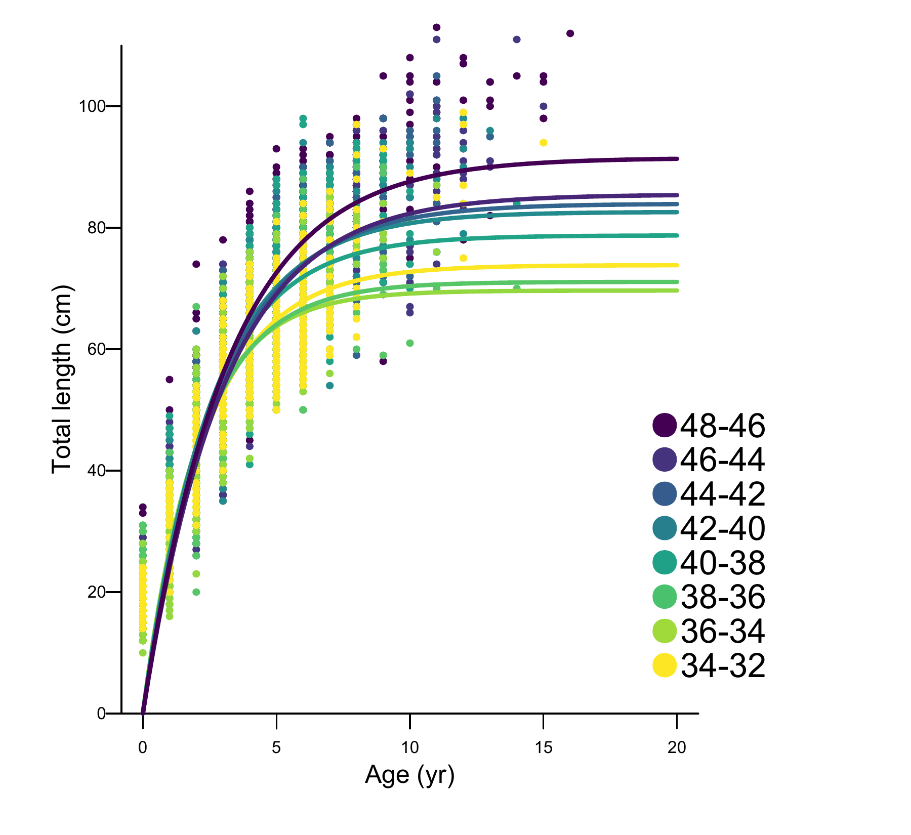

\clearpage
<!--
to do onboarding sa4ss - move this to sa4ss.sty so everyone's figures hold their order
https://stackoverflow.com/questions/29696172/how-to-hold-figure-position-with-figure-caption-in-pdf-output-of-knitr
-->
\floatplacement{figure}{H}
# Figures

Many more figures are available for the base model than what are included in this document.
For easy viewing in your web browser please feel free to view them on the web at
[Lingcod_2021](\url{https://iantaylor-noaa.github.io/Lingcod_2021/}).
During the review, decisions regarding which figures are included in the final document can be discussed.

## Data figures

```{r, setup-plotinfotable}
figurecsv <- utils::read.csv(
  file.path(params$model, "plots", "plotinfotable_for_doc.csv")
) %>%
  dplyr::mutate(caption = gsub("\\n", "", caption))
figurecsv[grepl("catch2", figurecsv[["label"]]), "caption"] <- "Landings (mt) by fleet (colors) used to fit the model."
```

```{r, results = "asis"}
do.call(
  sa4ss::add_figure,
  utils::read.csv(file.path("..", "figures", "map_of_stock_boundaries_40-10.csv"))
)
```

{width=100% height=100% alt="Size-at-age increases with increasing latitude."}

{width=100% height=100% alt="Change point was estimated at 38 degrees N latitude."}


<!-- ====================================================================== -->
<!-- 20Data figures -->
<!-- ====================================================================== -->

```{r, results = "asis"}
add_figure_ling(csv=figurecsv, "data_plot$")
```

```{r, catch-figures, results = "asis"}
# Arrange figures in order of the time they were modified
add_figure_ling(dplyr::bind_rows(mapply(
  FUN = utils::read.csv,
  file = dir(file.path("..","figures"), pattern = "^catch-.+\\.csv",full.names=TRUE),
  SIMPLIFY = FALSE
)) %>% dplyr::arrange(file.info(filein)$mtime)
)
```

```{r, cpue-figures-north, results = "asis", opts.label = "north", echo = FALSE}
# Use figures-cpue.csv to bring in ordered set of figures
figures_cpuedata <- utils::read.csv(file.path("..", "figures", "figures_cpue.csv"))
add_figure_ling(figures_cpuedata %>% dplyr::filter(grepl("cpue-commercialfixed", label)))
add_figure_ling(utils::read.csv(file.path("..", "figures", "reccpuewa.csv")))
add_figure_ling(figures_cpuedata %>% dplyr::filter(grepl("cpue-recreationalOregon", label)))
sa4ss::add_figure(
  filein = file.path("..", "figures", "OR_ORBS_CPUE", "ORBS_DataSummary.png"),
  label = "reccpueor-orbsdatasummary",
  caption = "Number of trips versus year, month, port, subregion, boat type, and effort (angler hours) for data that was used to estimate the Oregon recreational index."
)
sa4ss::add_figure(
  filein = file.path("..", "figures", "OR_ORBS_CPUE", "ORBS_DataSummary.png"),
  label = "reccpueor-mleqqscaledbin",
  alt_caption = "Diagnostic tests reveal one to one relationship between expected and observed residuals.",
  caption = "Scaled quantile-quantile (QQ) plot (left panel) and rank-transformed versus standardized residuals (right panel) for the binomial model of the Oregon recreational index."
)
sa4ss::add_figure(
  filein = file.path("..", "figures", "OR_ORBS_CPUE", "ORBS_DataSummary.png"),
  label = "reccpueor-mleqqscaledpos",
  alt_caption = "Diagnostic tests reveal one to one relationship between expected and observed residuals.",
  caption = "Scaled quantile-quantile (QQ) plot (left panel) and rank-transformed versus standardized residuals (right panel) for the positive model of the Oregon recreational index."
)
```
```{asis, opts.label = "north"}
 

 

 

 
```

<!--                                                                        -->
<!--                                                                        -->

<!-- WCGBTS -->

```{r, echo=FALSE, results='asis'}
nm = "WCGBTS_presence_absence_by_depth_bin.png"
sa4ss::add_figure(
filein = file.path("..", "figures", nm),
caption = paste0("Presence/absence of ", spp, " in the  \\glsentrylong{s-wcgbt} (\\glsentryshort{s-wcgbt}) by 25 m depth increments"),
label = 'wcgbts-presAbs')
```
<!-- Hook and line -->
```{asis, opts.label = "south"}
\begin{figure}
\includegraphics[width=0.85\linewidth]{Indices_for_Kelli/HookandLine_Harms_CCA_Lingcod} \caption{Map of the NWFSC hook-and-line survey site with circle indicating location at which vermilion rockfish were observed at least once.}(\#fig:spp-sites)
\end{figure}
 
 
 

```

<!-- WCGBTS -->

```{r, results = "asis"}
ignore <- mapply(FUN = sa4ss::add_figure,
  filein = file.path("..", "figures",
    paste0("WCGBTS - ", params$area, " _", c("Length", "Age"), "_Frequency.png")),
  caption = paste0(c("Length", "Age"), "-composition data for males and females in the \\glsentrylong{s-wcgbt} (\\glsentryshort{s-wcgbt})."),
  label = paste0("wcgbts-", c("len", "age"), "Comp")
)
ignore <- mapply(FUN = sa4ss::add_figure,
  filein = file.path("..", "figures",
    paste0("Triennial - ", params$area, " _", c("Length", "Age"), "_Frequency.png")),
  caption = paste0(c("Length", "Age"), "-composition data for males and females in the \\glsentrylong{s-tri} (\\glsentryshort{s-tri})."),
  label = paste0("tri-", c("len", "age"), "Comp")
)
```

<!-- Triennial -->

```{r, echo=FALSE, results='asis', opts.label = 'south'}
nm = "Triennial_cpueXdepth.png"
sa4ss::add_figure(
filein = file.path("..", "figures", nm),
caption = paste0("Raw catch per unit effort in  by depth in
                 the triennial survey. The black verticale line indicate
                 split in depth strata at 183m,
                 and red vertical line shows end of depth strata at 350m"),
label = 'tri-depthSplit')
```

<!-- Hook and Line -->

```{r, echo=FALSE, results='asis', opts.label = 'south'}
ignore <- mapply(FUN = sa4ss::add_figure,
  filein = file.path("..", "figures",
    paste0(c(
      "HNL lengths Male-Female_Length",
      "HNL lengths Unsexed_Length",
      "Hook and Line_Age"
    ), "_Frequency.png")
  ),
  caption = paste0(
    c("Length", "Length", "Age"),
    "-composition data for ",
    c("males and females ", "unsexed fish ", "males and females "),
    "in the ", sprintf("\\glsentrylong{s-%1$s} (\\glsentryshort{s-%1$s}).", "hkl")
  ),
  label = paste0("hkl-", c("len", "len", "age"), "Comp", c("-sexed", "-unsexed", ""))
)

```

<!-- Lam research -->

```{r, echo=FALSE, results='asis'}
nm = "Lam Thesis lengths Male-Female South_Length_Frequency.png"
sa4ss::add_figure(
filein = file.path("..", "figures", nm),
caption = "Length-composition data for male and females from Lam Research data",
label = 'lam-lenComp')
nm = "Lam Thesis ages Male-Female South_Age_Frequency.png"
sa4ss::add_figure(
filein = file.path("..", "figures", nm),
caption = "Age-composition data for male and females from Lam Research data",
label = 'lam-ageComp')
```

<!--- Oregon hook and line in marine reserves, index not used -->
```{r, results = "asis", opts.label = "north", echo = FALSE}
add_figure_ling(utils::read.csv(file.path("..", "figures", "figures-fi-index-ormarres.csv")))
```

<!-- comp_lendat_aggregated_across_time--->
<!-- comp_lenddat_page[12]_multi-fleet_comparison--->
<!-- don't show any CAAL in the report as raw data -->


<!-- ====================================================================== -->
<!-- Biology Figures -->
<!-- ====================================================================== -->

## Biology figures

```{r figures-biology, results = "asis"}
sa4ss::add_figure(
  filein = file.path("..", "figures", paste0("WCGBTS - ", params$area, " _length_fraction_female.png")),
  caption = "Fraction of the biological data from the \\gls{s-wcgbt} subset to just the area included in this assessment that are female by length (cm).",
  label = "biology-sexratio-lengthfractionfemale"
)

sa4ss::add_figure(
  filein = file.path("..", "figures", "biology_exploration", "Length_by_Latitude_JustCombo.png"),
  caption = "Histograms of lengths for female (top panel), male (middle panel) and unsexed (bottom panel) fish by latitude, in half degree increments. Samples sizes (N) for each sex are displayed in the upper left of each panel. Histograms show the median (solid bar), quartiles (colored boxes), 1.5 times interquartile range from the closest quartile or the most extreme data point (whiskers), and data beyond 1.5 times the interquartile range from the closest quartile (points)",
  label = "biology-sexratio-lengthbylatitude"
)
add_figure_ling(figurecsv %>% dplyr::filter(grepl("bio6_maturity", label)))
sa4ss::add_figure(
  filein = file.path("..", "figures", "age_mat_forassessment.png"),
  caption = "Proportion mature versus age (left panel; years) and length (right panel; cm) from fishery-independent and -dependent data sources. See Section \\@ref(sec-biological-data-maturation-and-fecundity) for details on the analysis.",
  label = "age-mat-forassessment"
)

nm = paste0("Length_Weight_Combo_", params$area, ".png")
sa4ss::add_figure(
filein = file.path("..", "figures", "biology_exploration", nm),
caption = "Weight-length relationship for males and females from the \\gls{s-wcgbt}",
label = "len-weight"
)

add_figure_ling(utils::read.csv(file.path("..", "figures", "ageing-double-reads.csv")))
add_figure_ling(figurecsv%>%dplyr::filter(grepl("numbers10",label)))
```

<!-- ====================================================================== -->
<!-- Recreational Length and Age Comps -->
<!-- ====================================================================== -->

```{r, results = "asis"}
do.call(
  sa4ss::add_figure,
  utils::read.csv(file.path("..", "figures", "rec_selectivity_illustration.csv"))
)
```

```{r, echo=FALSE, results='asis', opts.label = 'north'}
get_fleet("rec") %>%
  # Expand so each rec fleet has one row per sexes and types listed
  tidyr::crossing(sex = c("Sexed", "Unsexed"), type = c("Length", "Age")) %>%
  # Group lengths for a given fleet then ages
  dplyr::arrange(desc(type), order, sex) %>%
  # Keep only the appropriate fleets for the area
  dplyr::filter(!!as.name(paste0("used_", substr(Sys.Date(),1,4),".", tolower(substr(params$area,1,1))))) %>%
  # Create the caption and filename
  dplyr::mutate(
    alt_caption = "to do -- fill this in",
    filein = file.path(
      "..", "figures",
      paste0(
        ifelse(label_twoletter == "CA", paste(label_twoletter, params$area), label_twoletter),
        " Recreational - ",
        sex, "_", type,
        "_Frequency.png"
      )
    ),
    caption = paste0(stringr::str_to_title(type), "-composition data for the ", label_twoletter, " recreational fleet for ", tolower(sex), " fish."),
    label = paste0(tolower(label_twoletter), "-", substr(tolower(type), 1, 3), "comp-", tolower(sex))
  ) %>%
  dplyr::filter(file.exists(filein)) %>%
  dplyr::select(filein, caption, label, alt_caption) %>%
  add_figure_ling
```


<!-- ====================================================================== -->
<!-- VAST -->
<!-- ====================================================================== -->

```{r figures-vast, results = "asis"}
ignore <- mapply(
  FUN = add_figure_vast,
  SIMPLIFY = FALSE,
  file.path("..", "data-raw",
    sprintf("%s_%s_gamma", c("WCGBTS", "Triennial"), params$area)
  )
)
```


<!-- ====================================================================== -->
<!-- ******************     Model results    ********** --> 
<!-- ====================================================================== -->

## Model results figures

### Growth and selectivity

```{r, results = "asis",eval=FALSE}
do.call(
  sa4ss::add_figure,
  utils::read.csv(file.path(params$model, "custom_plots", "selectivity_comm.csv"))
)
```
```{r, results = "asis",eval =FALSE}
do.call(
  sa4ss::add_figure,
  utils::read.csv(file.path(params$model, "custom_plots", "selectivity_noncomm.csv"))
)
```


### Fits to data

```{r, results = "asis"}
do.call(
  sa4ss::add_figure,
  utils::read.csv(file.path(params$model, "custom_plots", "index_fits_all_fleets.csv"))
)
```

### Time series figures

```{r, figures-timeseries, echo = FALSE, results = "asis"}
add_figure_ling(csv = figurecsv, "ts7_.+with")
add_figure_ling(csv = figurecsv, "ts9_.+ls$")
add_figure_ling(csv = figurecsv, "ts1_Total")
add_figure_ling(csv = figurecsv, "ts9_.+ls$")
add_figure_ling(csv = figurecsv, "SR_curve$")
add_figure_ling(csv = figurecsv, "SPR2")
add_figure_ling(csv = figurecsv, "SPR4")
add_figure_ling(csv = figurecsv, "yield2")
```

### Sensitivity analyses and retrospectives

```{r, results = "asis",eval=FALSE, opts.label = north'}
do.call(
  sa4ss::add_figure,
  utils::read.csv(file.path(params$model, "custom_plots", "sens_timeseries_n_bio_rec.csv"))
)
do.call(
  sa4ss::add_figure,
  utils::read.csv(file.path(params$model, "custom_plots", "sens_timeseries_n_comp.csv"))
)
do.call(
  sa4ss::add_figure,
  utils::read.csv(file.path(params$model, "custom_plots", "sens_timeseries_n_index.csv"))
)
```
```{r, results = "asis",eval=FALSE, opts.label = 'south'}
do.call(
  sa4ss::add_figure,
  utils::read.csv(file.path(params$model, "custom_plots", "sens_timeseries_n_bio_rec.csv"))
)
do.call(
  sa4ss::add_figure,
  utils::read.csv(file.path(params$model, "custom_plots", "sens_timeseries_n_comp.csv"))
)
do.call(
  sa4ss::add_figure,
  utils::read.csv(file.path(params$model, "custom_plots", "sens_timeseries_n_index.csv"))
)
```

```{r, figures-retro, echo = FALSE, results = "asis"}
add_figure_retro(params$model, 5)
```

### Likelihood profiles

```{r, figures-profile, echo = FALSE, results = "asis"}
add_figure_profile(params$model, "NatM")
add_figure_profile(params$model, "steep")
add_figure_profile(params$model, "R0")
```

### Reference points and forecasts

### Comparisons of north and south models

```{r, results = "asis", eval = TRUE}
add_figure_ling(utils::read.csv(file.path("..", "figures", "figures_compare_north_vs_south.csv")))
```
