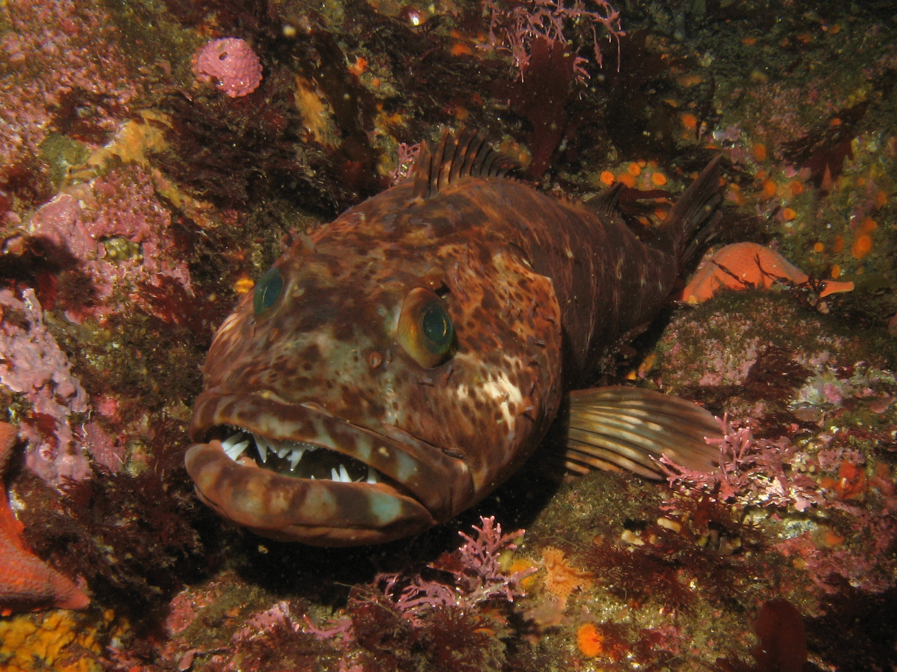
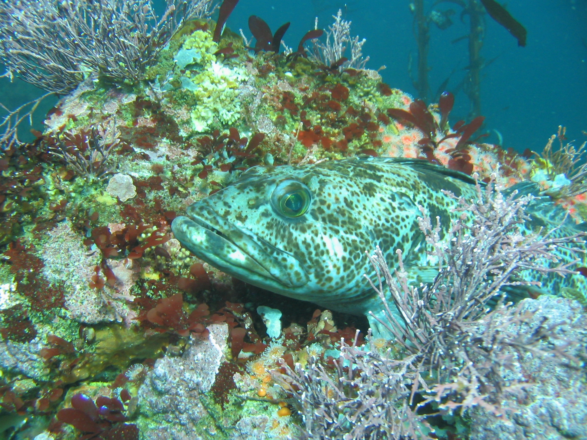
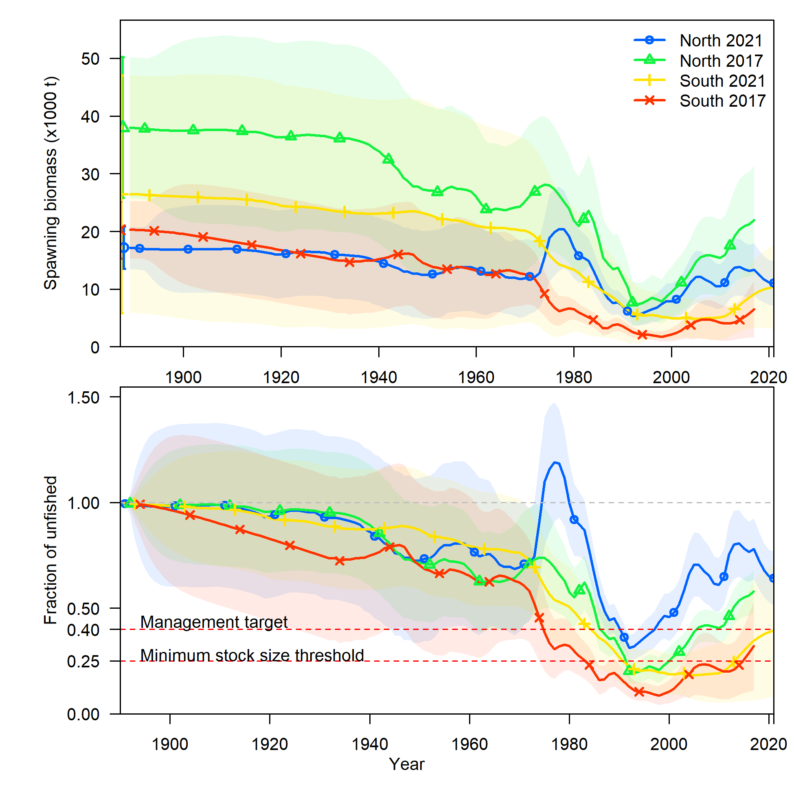
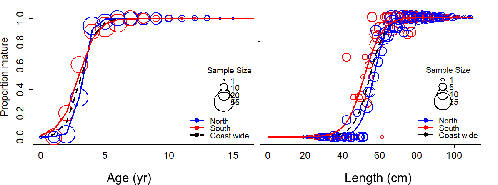
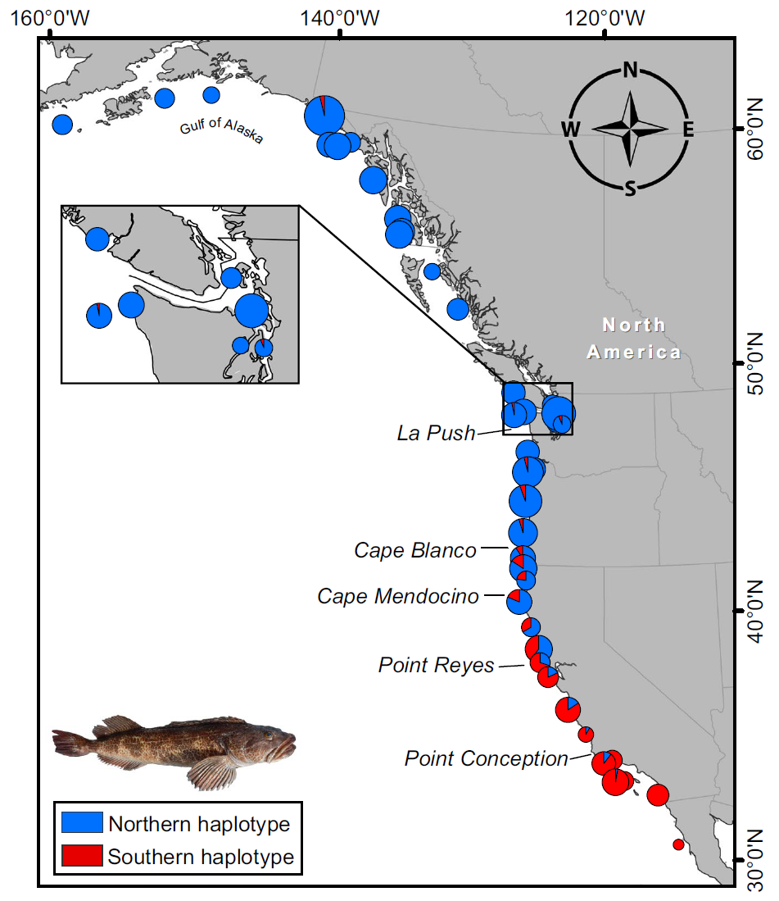
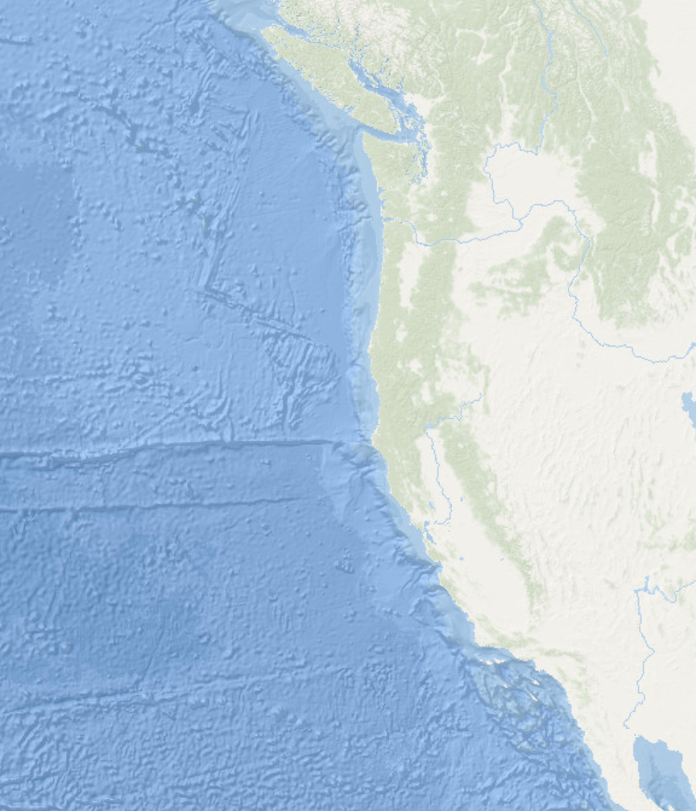

```{r setup, include=FALSE}
knitr::opts_chunk$set(
  echo = FALSE,
  message = FALSE,
  warning = FALSE,
  message = FALSE,
#   dev = "svg",
  fig.width = 12,
  fig.height = 12
  # fig.retina = 3
  )
xaringanthemer::style_mono_accent(
  # base_color = nmfspalette::nmfs_cols("darkblue"),
  base_color = "#00467F",
  header_font_google = xaringanthemer::google_font("Josefin Sans"),
  text_font_google   = xaringanthemer::google_font("Montserrat", "300", "300i"),
  code_font_google   = xaringanthemer::google_font("Fira Mono")
)
```

class: title-slide, inverse
```{css}
<style>
.center2 {
  margin: 0;
  position: absolute;
  top: 50%;
  left: 50%;
  -ms-transform: translate(-50%, -50%);
  transform: translate(-50%, -50%);
}
</style>
```
```{css}
.code-bg-white .remark-code, .code-bg-white .remark-code * {
 background-color:white!important;
}
```

.bg-text[
# Lingcod status and structure
<hr />
Lingcod STAT<br><br>
July 12, 2021<br>
]

---
class: top
background-image: url("../figures/NOAA_Logo_Full.jpg")
background-size: 20%
background-position: 0% 100%

### Background

.pull-left-60[
- Lingcod are a value target species for commercial and recreational fisheries

- Declared overfished coastwide in 1999 and rebuilt in 2005

- Stocks were last assessed in 2017

- Lots of data, more so for the north

- Data not necessarily very informative about key quantities


]

.pull-right-40[



<p style="font-size:9px;margin-top:-25px;">
By Magnus Kjaergaard, CC BY-SA 2.5, <a href = "https://commons.wikimedia.org/w/index.php?curid=882582">https://commons.wikimedia.org/w/index.php?curid=882582</a>
</p>



<p style="font-size:9px;margin-top:-25px;">
By John Crofts, Public Domain,
<br><a href = "https://commons.wikimedia.org/w/index.php?curid=17985885">
https://commons.wikimedia.org/w/index.php?curid=17985885</a>
</p>
]
---


### Changes for 2021

- Changed stock boundary (more on this later)

- Re-analyzed all data inputs from the raw data (except trawl logbook index)

- Added new data from 2017 - 2020

- Added new ages from some earlier years

- Updated biology parameters (length-weight and maturity)

- Revisited selectivity and retention assumptions 

- Estimated mortality and steepness with priors

- Used Bayesian diagnostics helped determine problematic parameters

- Developed a new workflow for the assessment as an R package: 
https://github.com/pfmc-assessments/lingcod/

- Posted model results to the web for easy exploration:
https://iantaylor-noaa.github.io/Lingcod_2021/

---

### Overview of results: time series

<!-- calculations related to range of overfished years:
range(mod.s$timeseries$Yr[mod.s$timeseries$SpawnBio < 
                          0.25 * mod.s$timeseries$SpawnBio[1]])
-->

.pull-left-40[
- 2021 results not directly comparable to 2017 due to boundary change

- Both stocks estimated above the $B_{40\%}$ reference point in 2021

- North stock estimated as having never been overfished (below $B_{25\%}$)

- South stock estimated as having been overfished during the period 
1990 - 2011

]

.pull-right-60[]

---

### Lingcod biology

.pull-left[
- Lingcod have faster dynamics than many of the groundfish on this coast:
  - faster growth, 
  - earlier maturing,
  - fewer old individuals observed

- Exhibit sex-specific differences in behavior and distribution

- Additional ageing for 2021 made possible new age-based maturity curves

- Frequently encountered in bottom trawl survey but declines in occurrence from 200-400 m
]

.pull-right[
<!-- -->


<p style="font-size:12px;margin-top:-25px;">
Age- and length-based functional maturity


<p style="font-size:12px;margin-top:-25px;">
Presence/absence of lingcod in the NWFSC West Coast Groundfish Bottom
Trawl Survey (WCGBTS) by 25 m depth increments.

]

---

### Stock structure 1

.pull-left[
- Longo et al. 2020 found genetic differentiation along the coast:
  > evidence suggests that the distinct genetic cline in lingcod is most likely a product of selection driven by change (continuous and/or discontinuous) in environmental conditions
- No clean break between areas
- Presence of "admixed individuals" in northern California also noted
- Additional genetic research ongoing
]

.pull-right[

<p style="font-size:12px;margin-top:-25px;">
Figure 2 from Longo et al. 2020. <a href = "https://doi.org/10.1111/eva.13037">
https://doi.org/10.1111/eva.13037</a>
</p>
]

---

### Stock structure 2

.pull-left[
- Cape Mendocino (40°10' N) chosen to split north and south stocks
- Transition zone exists rather than a clear break between north and south populations 
- Sample sizes were low for each sampling location inhibiting clear boundaries
- Cape Mendocino is a biogeographic break for many stocks
- Splitting data from California at 40°10' N was more straightforward than other options
- Areas modeled as independent populations
- Model output aligns with Individual Fishing Quota boundaries
]

.pull-right[

<p style="font-size:12px;margin-top:-25px;">
Chosen stock boundaries for 2021 assessments.
</p>
]

---

### Stock structure 3

.pull-left[
- Point Conception (34°27' N) was discussed as additional break due to 
differences in biogeography in the Southern California Bight

- Genetic analysis does not suggest a break at that point

- Splitting the data available for the south into areas
may lead to less reliable parameter estimates and a worse tool for management

- Other options are available for spatial management of fisheries in California
]

.pull-right[

<p style="font-size:12px;margin-top:-25px;">
Chosen stock boundaries for 2021 assessments.
</p>
]

---

### Stock structure 4

.pull-left[

<p style="font-size:12px;margin-top:-25px;">
Bathymetry of the U.S. west coast.
</p>
]

.pull-right[

<p style="font-size:12px;margin-top:-25px;">
Chosen stock boundaries for 2021 assessments.
</p>
]

---
