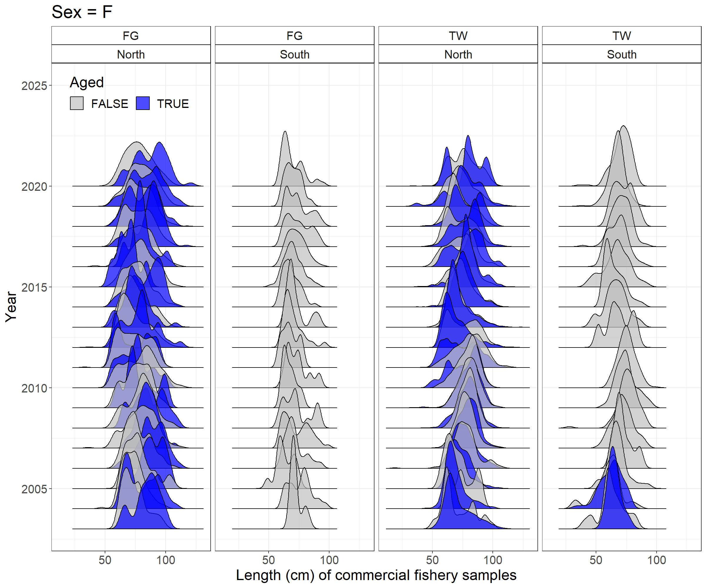
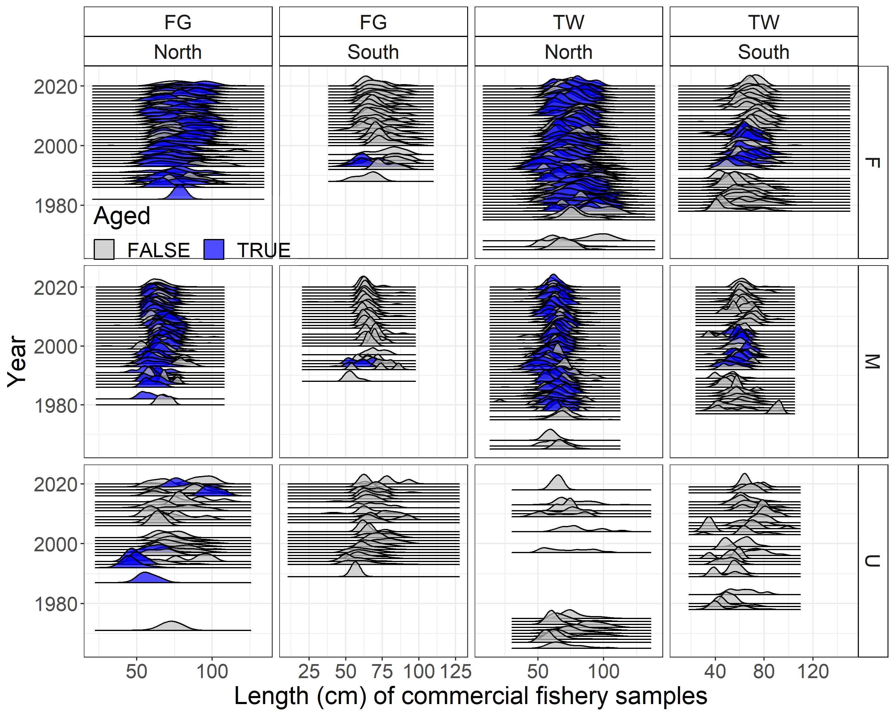

```{r setup, include=FALSE}
knitr::opts_chunk$set(
  echo = FALSE,
  message = FALSE,
  warning = FALSE,
  message = FALSE,
#   dev = "svg",
  fig.width = 12,
  fig.height = 12
  # fig.retina = 3
  )
xaringanthemer::style_mono_accent(
  # base_color = nmfspalette::nmfs_cols("darkblue"),
  base_color = "#00467F",
  header_font_google = xaringanthemer::google_font("Josefin Sans"),
  text_font_google   = xaringanthemer::google_font("Montserrat", "300", "300i"),
  code_font_google   = xaringanthemer::google_font("Fira Mono"),
  colors = c(noaablue = "#00467F")
)
```

class: title-slide, inverse
```{css}
<style>
.center2 {
  margin: 0;
  position: absolute;
  top: 50%;
  left: 50%;
  -ms-transform: translate(-50%, -50%);
  transform: translate(-50%, -50%);
}
</style>
```
```{css}
.code-bg-white .remark-code, .code-bg-white .remark-code * {
 background-color:white!important;
}
```

.bg-text[
# Lingcod data

## Catches, indices, length compositions, conditional age-at-length compositions, ageing error, mean body weight, discard rates

<hr />
Lingcod STAT<br><br>
July 12, 2021<br>
]

---
class: split-20
name: data-north

.column.bg-noaablue[
#### .white[Northern data]
]
.column.bg-white[
```{r figure-data-north, results = "asis"}
sa4ss::add_figure(
  width = 80,
  file.path("..", "docs", "North", "data_plot.png"),
  caption = ""
)
```
]
---
class: split-20
name: data-south

.column.bg-noaablue[
#### .white[Southern data]
]
.column.bg-white[
```{r figure-data-south, results = "asis"}
sa4ss::add_figure(
  width = 80,
  file.path("..", "docs", "South", "data_plot.png"),
  caption = ""
)
```
]

---
class: top

### General plan

--

- Utilize sex-specific data when available

--

- Split data at $40^{\circ}10'$ instead of $42^{\circ}00'$

--

  - Revisit every data source used in 2017

--

  - Add a northern California recreational fleet

???
* Kept OR and CA recreational data as separate fleets because of differences in management
* Trawl logbook data was not re-analyzed just re-stratified, a re-analysis was not necessary because updates to Oregon information did not pertain to the time period under consideration

---
class: split-20

.column.bg-noaablue[
#### .white[2021 landings]

.white[
* North

* South
]
]

.column.bg-white[
```{r figure-catch2, results = "asis"}
sa4ss::add_figure(
  width = 80,
  file.path("..", "docs", "North", "catch2 landings stacked.png"),
  caption = ""
)
sa4ss::add_figure(
  width = 80,
  file.path("..", "docs", "South", "catch2 landings stacked.png"),
  caption = ""
)
```
]
???
Large percentage of landings in the southern area from the recreational fleet in comparison to a much smaller percentage in the north.

---
class: split-20

.column.bg-noaablue[
#### .white[Indices]

.white[
* North

* South
]

**No surveys in 2020 because of Covid-19**
]

.column.bg-white[
```{r figure-indices, results = "asis"}
sa4ss::add_figure(
  width = 80,
  file.path("..", "docs", "North", "index_fits_all_fleets.png"),
  caption = ""
)
sa4ss::add_figure(
  width = 70,
  file.path("..", "docs", "South", "index_fits_all_fleets.png"),
  caption = ""
)
```
]
???
* No surveys
* Limited biological sampling
* Difficulties getting age structures prepped and read because of issues with social distancing and lab availability
* **to do - insert figure**

---
### Age- and length-composition data


---

```{r figure-agelength-wcgbts, fig.height = 10, fig.retina = 3, cache = TRUE}
ggplot2::ggplot(bio.WCGBTS %>% dplyr::filter(!is.na(Sex)),
  ggplot2::aes(
    x = Length_cm,
    y = Year,
    group = interaction(Year,factor(!is.na(Age))),
    fill = factor(!is.na(Age))
    )
  ) +
  ggridges::geom_density_ridges2(scale = 5, alpha = 0.7) +
  ggplot2::facet_grid(Sex ~ ifelse(Latitude_dd <= 40.1667, "South", "North")) +
  ggplot2::theme_bw() +
  ggplot2::guides(fill = ggplot2::guide_legend(title = "Aged")) +
  ggplot2::theme(
    text = ggplot2::element_text(size=20),
    strip.background = ggplot2::element_rect(colour = "black", fill = "white"),
    legend.position = "top"
  ) +
  ggplot2::xlab("Length (cm) of West Coast Groundfish Bottom Trawl Survey") +
  ggplot2::ylab("Year") +
  ggplot2::scale_fill_manual(values = c("gray", "blue"))
```

---

```{r figure-agelength-triennial, fig.height = 10, fig.retina = 3, cache = TRUE}
ggplot2::ggplot(bio.Triennial[[2]] %>% dplyr::filter(!is.na(Sex)),
  ggplot2::aes(
    x = Length_cm,
    y = Year,
    group = interaction(Year,factor(!is.na(Age))),
    fill = factor(!is.na(Age))
    )
  ) +
  ggridges::geom_density_ridges2(scale = 5, alpha = 0.7) +
  ggplot2::facet_grid(Sex ~ ifelse(Latitude_dd <= 40.1667, "South", "North")) +
  ggplot2::theme_bw() +
  ggplot2::guides(fill = ggplot2::guide_legend(title = "Aged")) +
  ggplot2::theme(
    text = ggplot2::element_text(size=20),
    strip.background = ggplot2::element_rect(colour = "black", fill = "white"),
    legend.position = "top"
  ) +
  ggplot2::xlab("Length (cm) of Triennial Survey") +
  ggplot2::ylab("Year") +
  ggplot2::scale_fill_manual(values = c("gray", "blue"))
```
???
* Triennial does not cover the entire Southern area
* Triennial changed spatial coverage mid-stream, which is not accounted for within the composition data

---

.pull-right[
```{r figure-agelength-lam, fig.height = 20, fig.retina = 3, cache = TRUE}
ggplot2::ggplot(bio.HKLage.Lam %>% dplyr::filter(!is.na(sex)),
  ggplot2::aes(
    x = length_cm,
    y = year,
    group = interaction(year,factor(!is.na(age_years))),
    fill = factor(!is.na(age_years))
    )
  ) +
  ggridges::geom_density_ridges2(scale = 5, alpha = 0.7) +
  ggplot2::facet_grid(sex ~ .) +
  ggplot2::theme_bw() +
  ggplot2::guides(fill = ggplot2::guide_legend(title = "Aged")) +
  ggplot2::theme(
    text = ggplot2::element_text(size=40),
    strip.background = ggplot2::element_rect(colour = "black", fill = "white"),
    legend.position = "top"
  ) +
  ggplot2::xlab("Length (cm) of Hook & Line Survey") +
  ggplot2::ylab("Year") +
  ggplot2::scale_fill_manual(values = c("blue"))
```
]

---
.center[

]

---
.center[

]

---
#### Ageing error

- Similar among age readers

--

- Informed using ages from fin-rays only

--

- Standard deviation of ageing error

  - **0.24** years at age one,

  - **0.56** years at age five,

  - **1.10** years at age ten, and

  - **1.65** years at age fifteen

--

- Future research

  - International comparison of ages from fin rays versus otoliths

    - Alaska ages with otoliths

    - Difference can be upwards of five years in older fish

    - Are fish in the north actually older?

  - Inclusion of ageing error in sampling scheme within [ss3sim](www.github.com/ss3sim/ss3sim)

---
#### Maximum age

| Female | Male | Source
| ------ | ---- | ------
| 21     | 21   | Haltuch et al. 2017
| 18     | 13   | Taylor et al. 2021
| 18     | 13   | Johnson et al. 2021
| 20     | 14   | DFO Canada
| 36     | 36   | [Alaska](https://mtalab.adfg.alaska.gov/ADU/analysis.aspx#/maxage)


---
### Extra slides

---
class: split-20

.column.bg-noaablue[
#### .white[Commercial landings]
]

.column.bg-white[
```{r catch-comm-state, results = "asis"}
do.call(sa4ss::add_figure, c(width = 100, height = 90,utils::read.csv((file.path("..", "figures", "catch-comm-state.csv")))))
```
]

???
* Previously, a linear interpolation of reconstructed catches in California
* Management measures in 1998 which led to decreased catches
