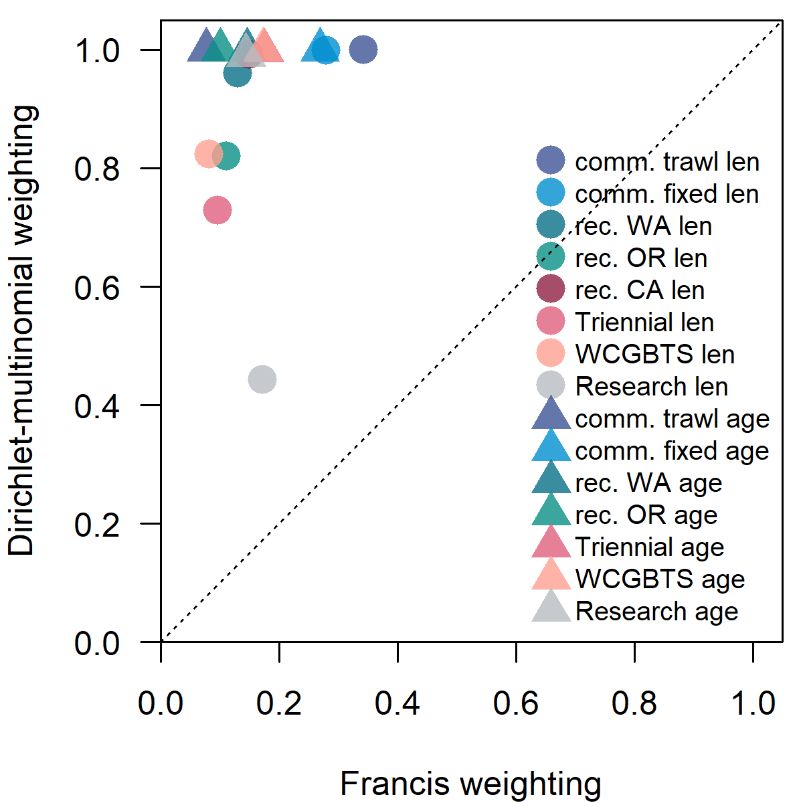
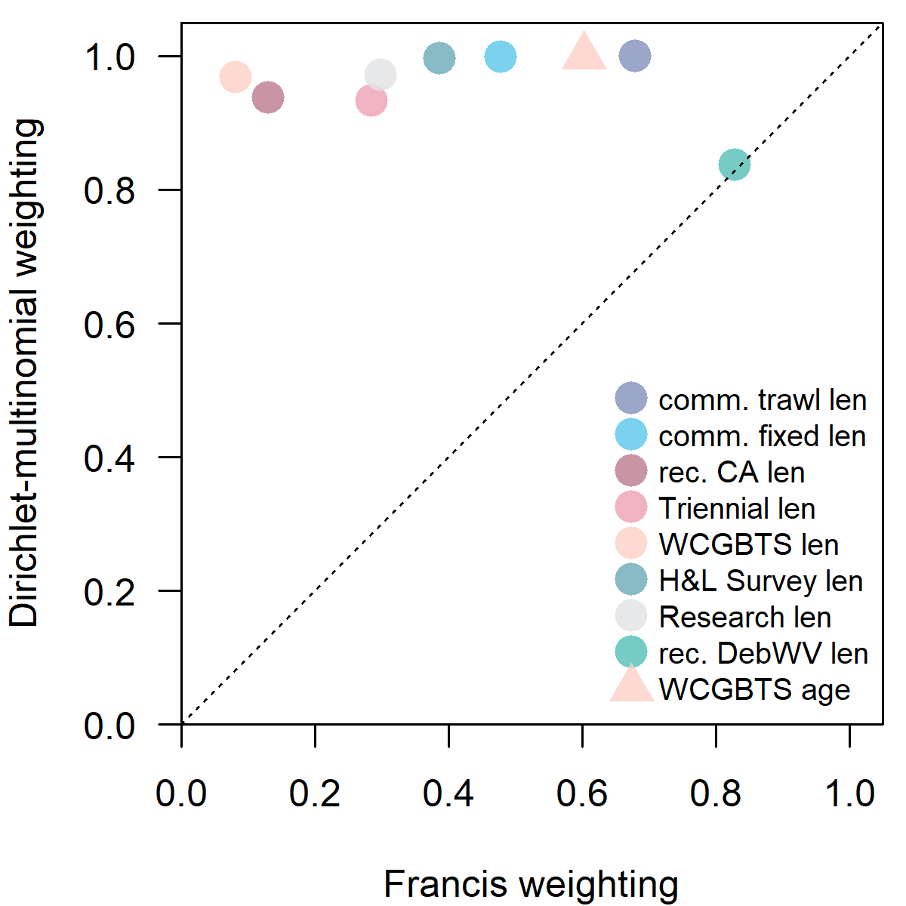
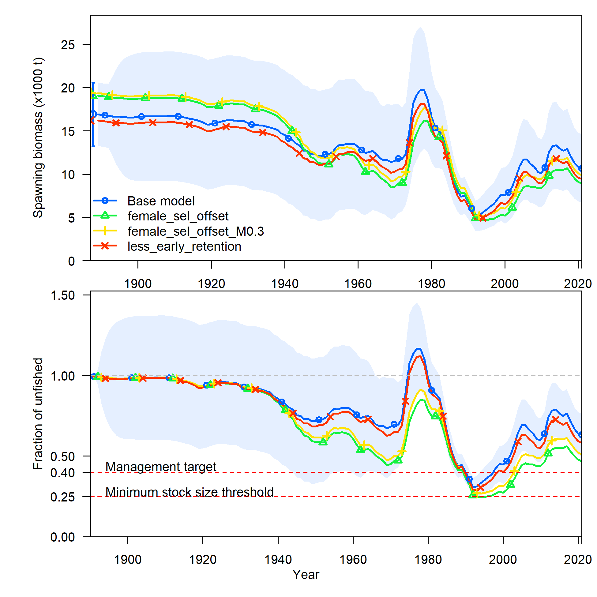
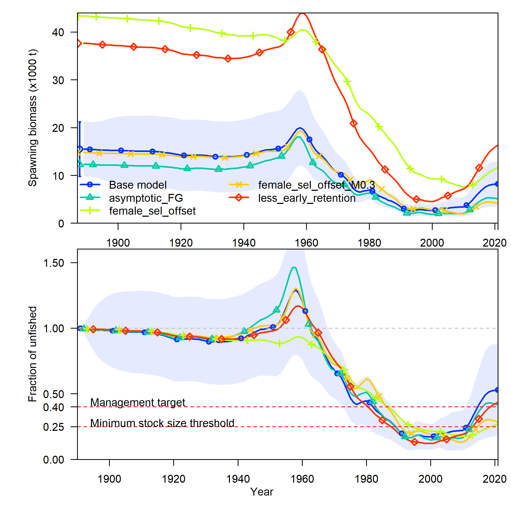
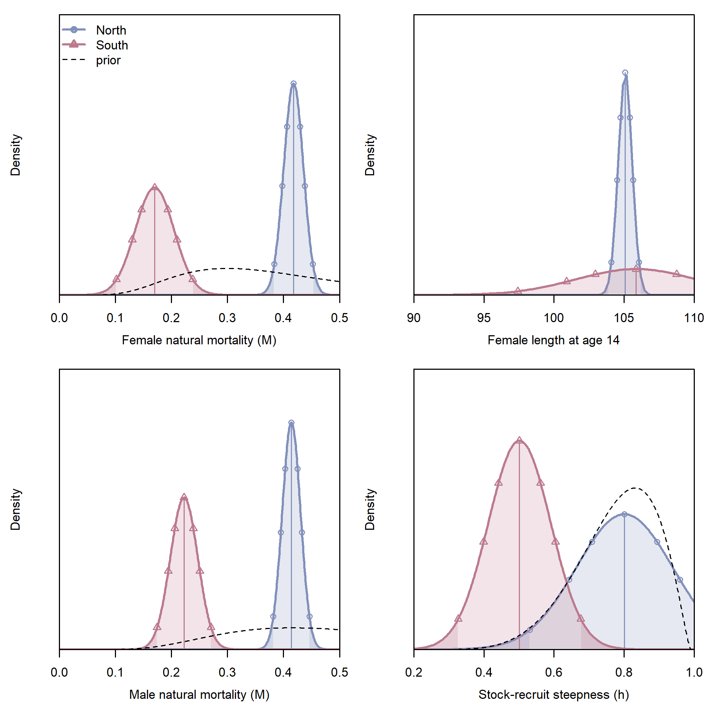
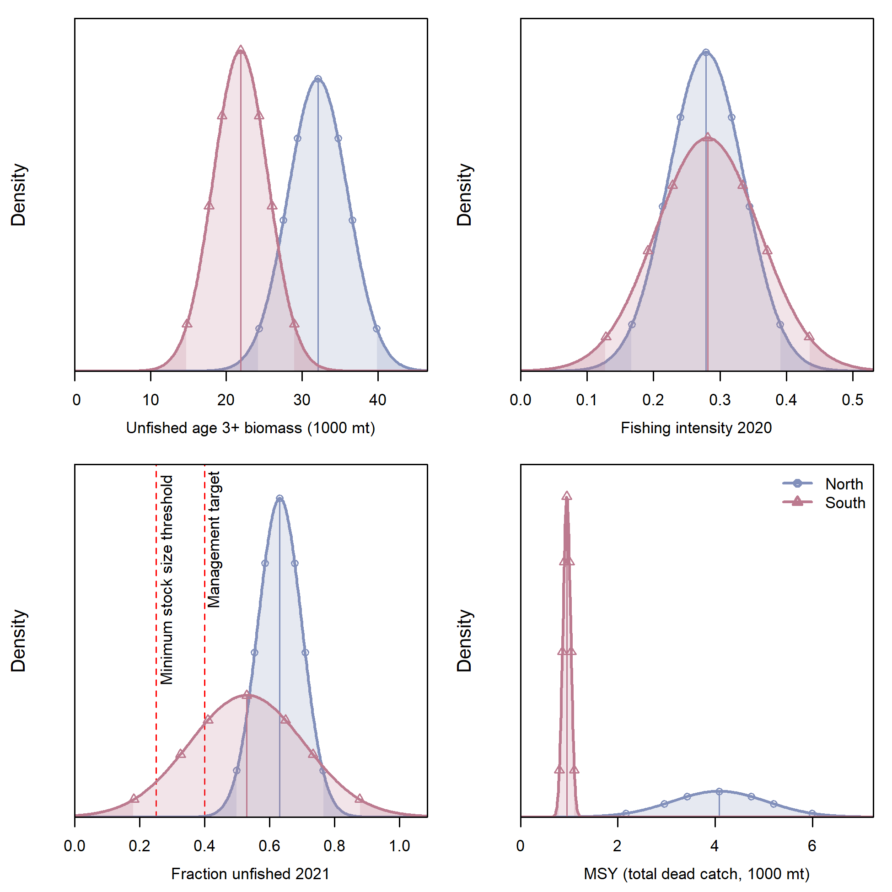

```{r setup, include=FALSE}
knitr::opts_chunk$set(
  echo = FALSE,
  message = FALSE,
  warning = FALSE,
  message = FALSE,
#   dev = "svg",
  fig.width = 12,
  fig.height = 12
  # fig.retina = 3
  )
xaringanthemer::style_mono_accent(
  # base_color = nmfspalette::nmfs_cols("darkblue"),
  base_color = "#00467F",
  header_font_google = xaringanthemer::google_font("Josefin Sans"),
  text_font_google   = xaringanthemer::google_font("Montserrat", "300", "300i"),
  code_font_google   = xaringanthemer::google_font("Fira Mono")
)
```

class: title-slide, inverse
```{css}
<style>
.center2 {
  margin: 0;
  position: absolute;
  top: 50%;
  left: 50%;
  -ms-transform: translate(-50%, -50%);
  transform: translate(-50%, -50%);
}
</style>
```
```{css}
.code-bg-white .remark-code, .code-bg-white .remark-code * {
 background-color:white!important;
}
```

.bg-text[
# Lingcod modeling and results
<hr />
Lingcod STAT<br><br>
July 12, 2021<br>
]

---
class: top

### Outline

This presentation will focus on three things:

- key diagnostics that were instrumental in the model selection process

- a subset of the sensitivities which provide useful information about the base models

- comparison of results for north and south models

More detailed model results and fits to data can be explored as needed using
the materials posted to https://iantaylor-noaa.github.io/Lingcod_2021/

???
Comments that are hidden.

---
class: top

### 2017 STAR panel recommendations

--

1. Cross-validate age-readings among labs and year

2. Acquire information from Canadian and Mexican authorities

3. Investigate stock structure

4. Concern for ages of unsexed fish being assigned equally to the sexes without regard for length

3. Perform a spatially-explicit stock assessment model

5. Fixed length at age 14 in North model

6. Estimate other key parameters, namely $M$ and $h$

7. Estimate area of habitat per area

---
class: top
### 2017 STAR panel recommendations

1. Cross-validate age-readings among labs and year

2. Acquire information from Canadian and Mexican authorities

3. Investigate stock structure

4. Concern for ages of unsexed fish being assigned equally to the sexes without regard for length

3. Perform a spatially-explicit stock assessment model

5. Fixed length at age 14 in North model: .noaablue[**estimated and performed likelihood profiles**]

6. Estimate other key parameters, namely $M$ and $h$: .noaablue[**estimated**]

7. Estimate area of habitat per area

---

### Diagnostics

- Likelihood profiles

- 100 jitter iterations

- Correlation of Bayesian posteriors, particularly selectivity parameters

- Fits to the data

---

### North

---

### South

---

### North sensitivity to biology and recruitment
.pull-left-30[
- North model was not sensitive to most of these changes
- Largest change came from fixing female M = 0.3 and h = 0.7
- Base model estimates were M = 0.41 and h = 0.80
]

.pull-right-70[

]

---

### North sensitivity to biology and recruitment

<p style="margin-top:-25px;">
`r table_sens("../tables/sens_table_n_bio_rec.csv", caption = "", format = "html") %>%
      kableExtra::kable_styling(font_size = 12) 
`
---

### South sensitivity to biology and recruitment

.pull-left-30[
- South model was not sensitive to most of these changes
- Largest change came from fixing female M = 0.3 and h = 0.7
- Base model estimates were M = 0.26 and h = 0.54
]

.pull-right-70[

]

---

### South sensitivity to biology and recruitment
<p style="margin-top:-25px;">
`r table_sens("../tables/sens_table_s_bio_rec.csv", caption = "", format = "html") %>%
      kableExtra::kable_styling(font_size = 12) 
`
---

### North sensitivity to composition data

.pull-left-40[
- Dirichlet-multinomial likelihood:
  - increased weight on all comps
  - reduced fit to survey
  - reduced differentiation in weights among fleets
  

]

.pull-right-60[

]

---

### North sensitivity to composition data
<p style="margin-top:-25px;">
`r table_sens("../tables/sens_table_n_comp.csv", caption = "", format = "html") %>%
      kableExtra::kable_styling(font_size = 12) 
`
---

### South sensitivity to composition data

.pull-left-40[
- South model was sensitive to most changes in comp data
- D-M likelihood again increased comp weights
- Adding more age data pushed scale to implausibly high levels
  

]

.pull-right-60[

]

---

### South sensitivity to composition data
<p style="margin-top:-25px;">
`r table_sens("../tables/sens_table_s_comp.csv", caption = "", format = "html") %>%
      kableExtra::kable_styling(font_size = 12) 
`
---


### Additional sensitivities: selectivity & retention

An additional set of senstivities not included in the assessment reports:

1. make commercial fixed-gear fleet have asympotic selectivity
<br>(south only as north already had FG estimated asymptotic)

2. add an offset parameter to estimate sex-specific selectivity

3. sex-specific selectivity + fix female _M_ at 0.3

4. model retention prior to 1998 as equal to the current era (2011-onward) rather 
than retaining almost 100% of all fish

---

### North sensitivity to selectivity & retention

.pull-left-30[
- little sensitivity to retention assumption
- sex-offset causes female selectivity << male selectivity 
- confounded with estimates of male _M_: males died faster but were more selected
]

<!-- to do: move selelectivity and retention figs into docs and add to HTML -->
<!-- to do: add figures showing female vs male selectivity with offset -->
.pull-right-70[

]


---

### North sensitivity to selectivity & retention
<p style="margin-top:-25px;">
`r table_sens("../tables/sens_table_n_sel.csv", caption = "", format = "html") %>%
      kableExtra::kable_styling(font_size = 12) 
`
---


### South sensitivity to selectivity & retention

.pull-left-30[
- retention sensitivity caused implausible shapes for early selectivity
- sex-offset had similar effect as for north but with greater
impact on biomass estimates
- female selectivity << male selectivity 
- confounded with estimates of male _M_: males died faster but were more selected
]

<!-- to do: move selelectivity and retention figs into docs and add to HTML -->
<!-- to do: add figures showing female vs male selectivity with offset -->
.pull-right-70[

]

---

### South sensitivity to selectivity & retention
<p style="margin-top:-25px;">
`r table_sens("../tables/sens_table_s_sel.csv", caption = "", format = "html") %>%
      kableExtra::kable_styling(font_size = 12) 
`

---


<!-- ### Comparison of areas: growth -->

### Comparison of areas: key parameters

.pull-left-40[
- Sex-specific natural mortality $M$ estimated with separate priors in both models
- Stock-recruit steepness $h$ estimated with informative prior for both models
- North model estimates associated with a more productive stock:
  - greater length-at-age (also more precisely estimated), 
  - higher $M$, and 
  - higher $h$

]

.pull-right-60[]

---

### Comparison of areas: quantities of interest
.pull-left-40[
- Unfished biomass more similar than would be expected given relative area
of the two regions
- Rough estimate is ~2.3x larger area in the north
- Fishing intensity in 2020 is similar in both regions
- Fraction unfished in 2021 is greater in the north than the south and more
precisely estimated
- MSY significantly larger in the north than the south
]
.pull-right-60[

]

---

### Concluding comments?
