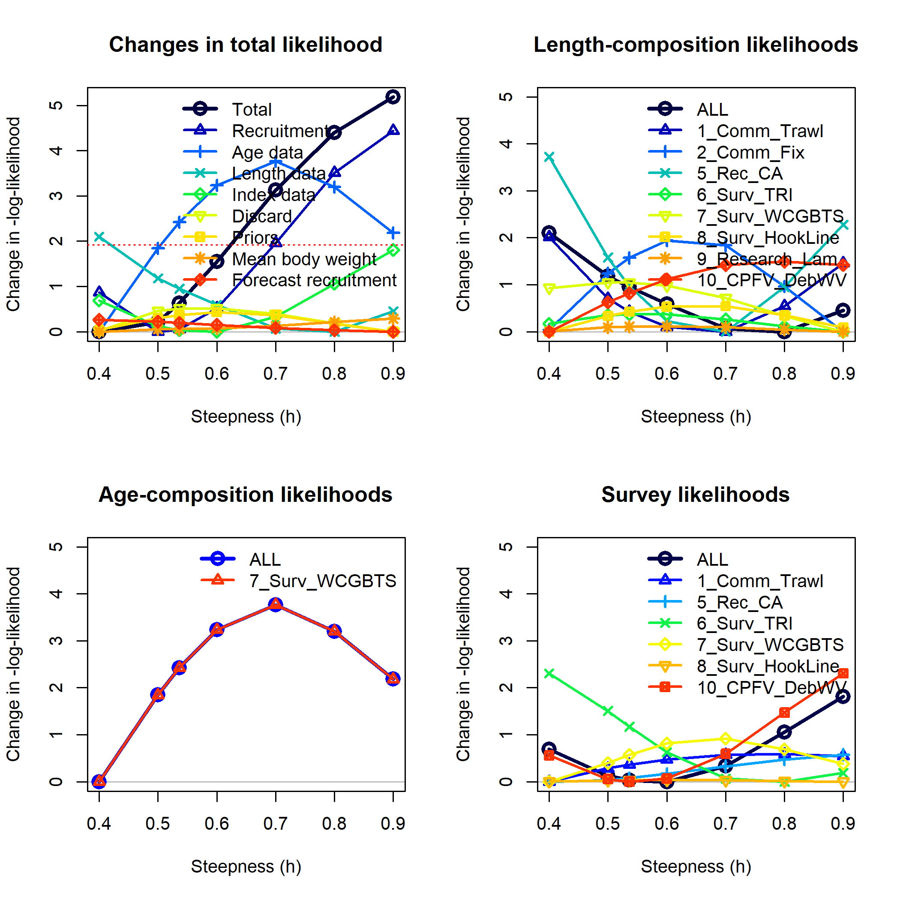
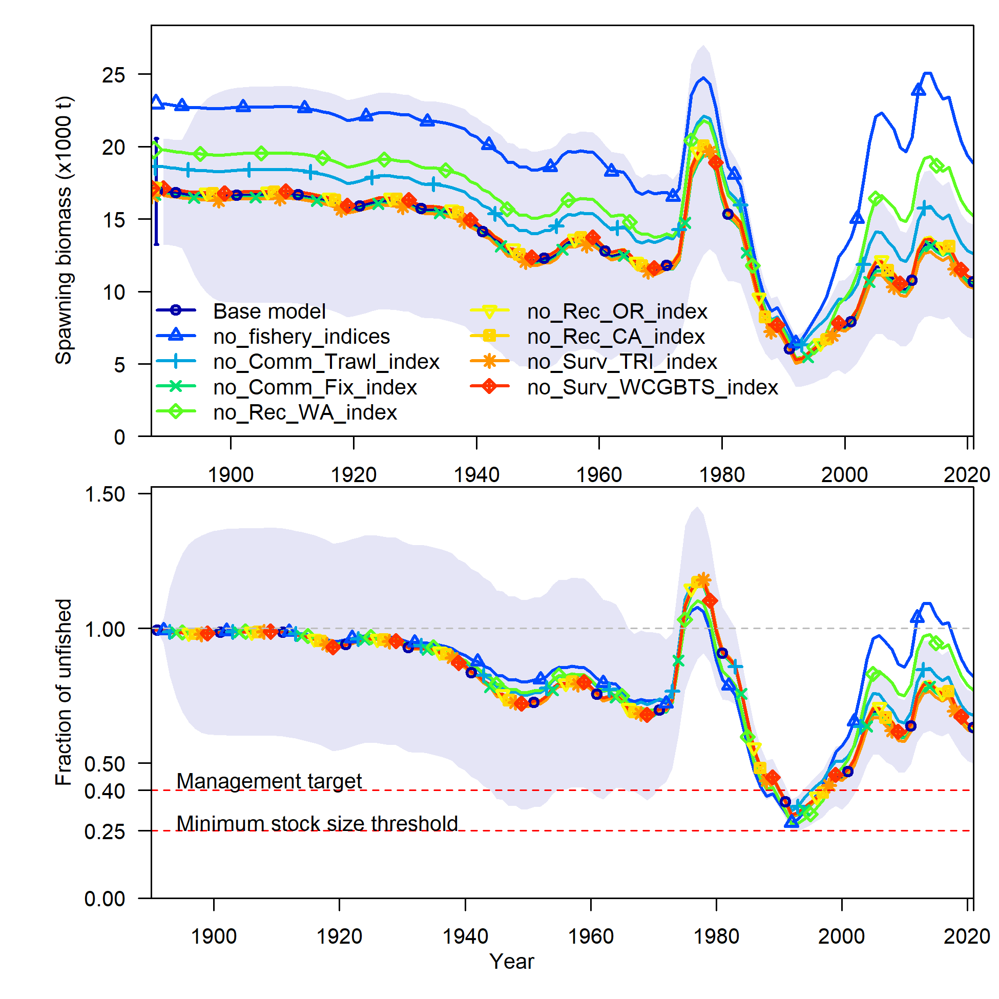
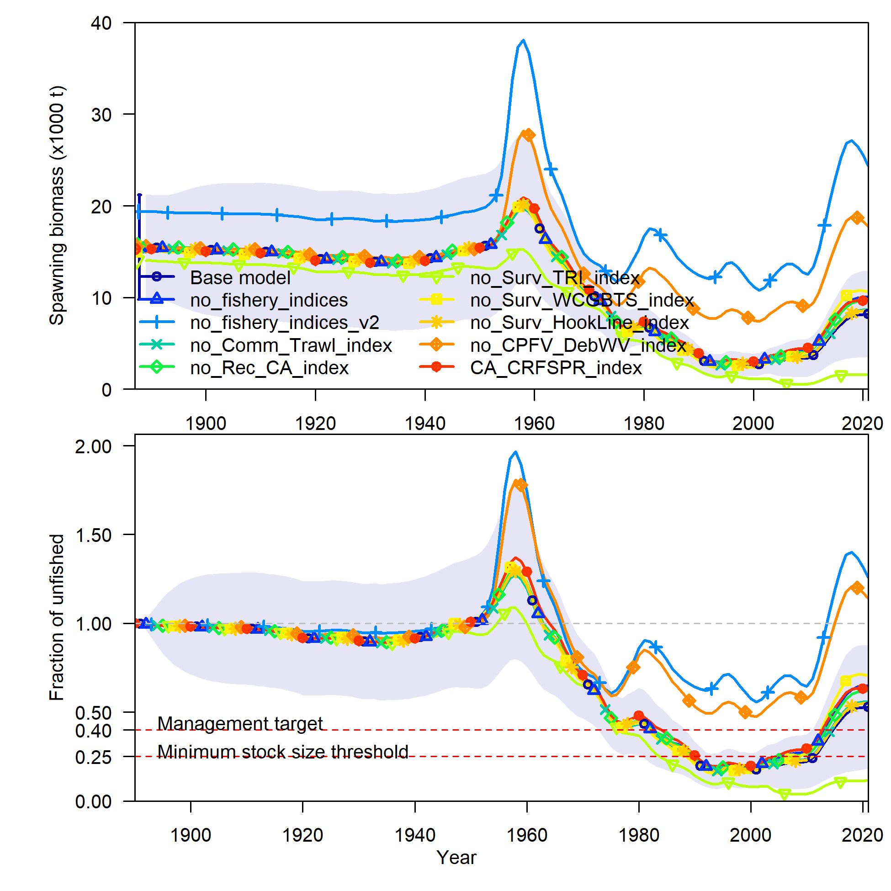
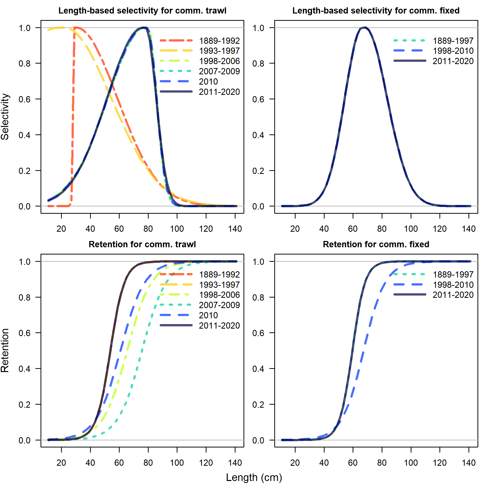
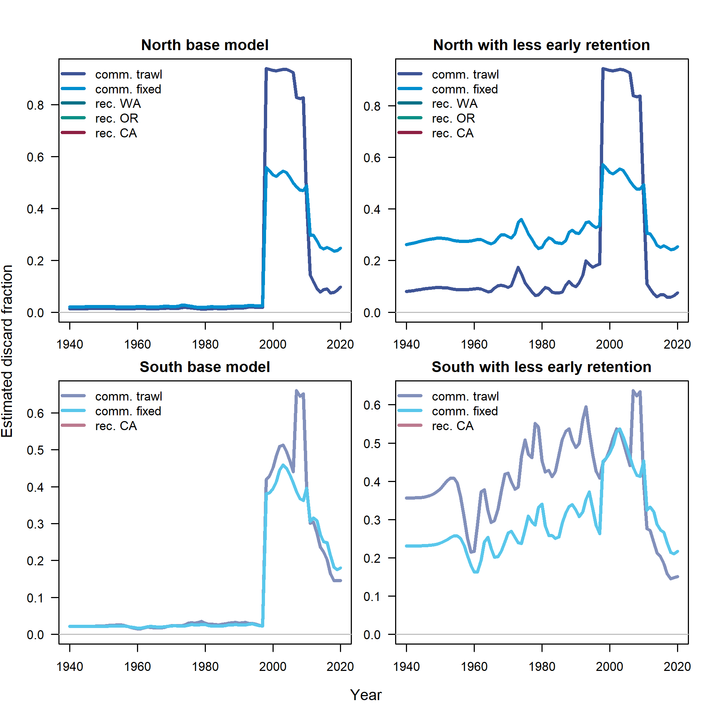
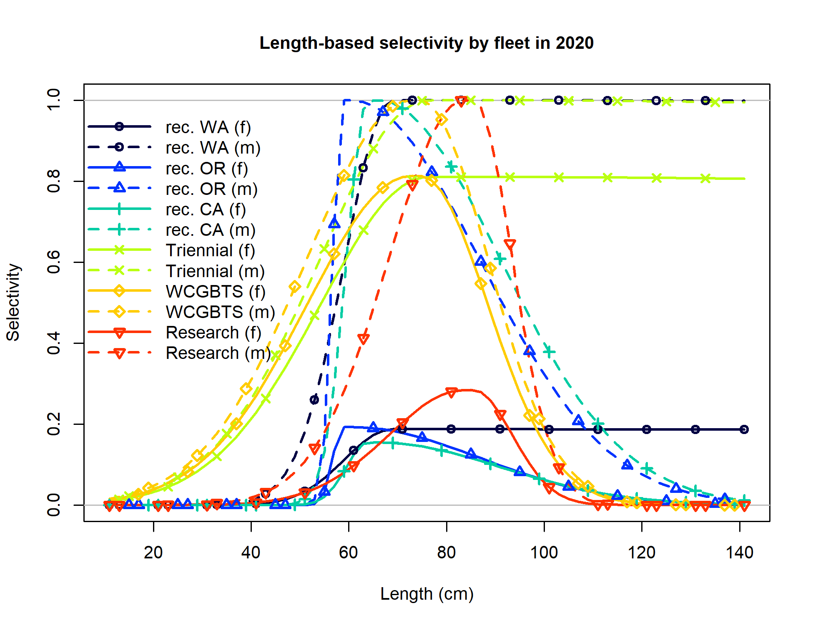
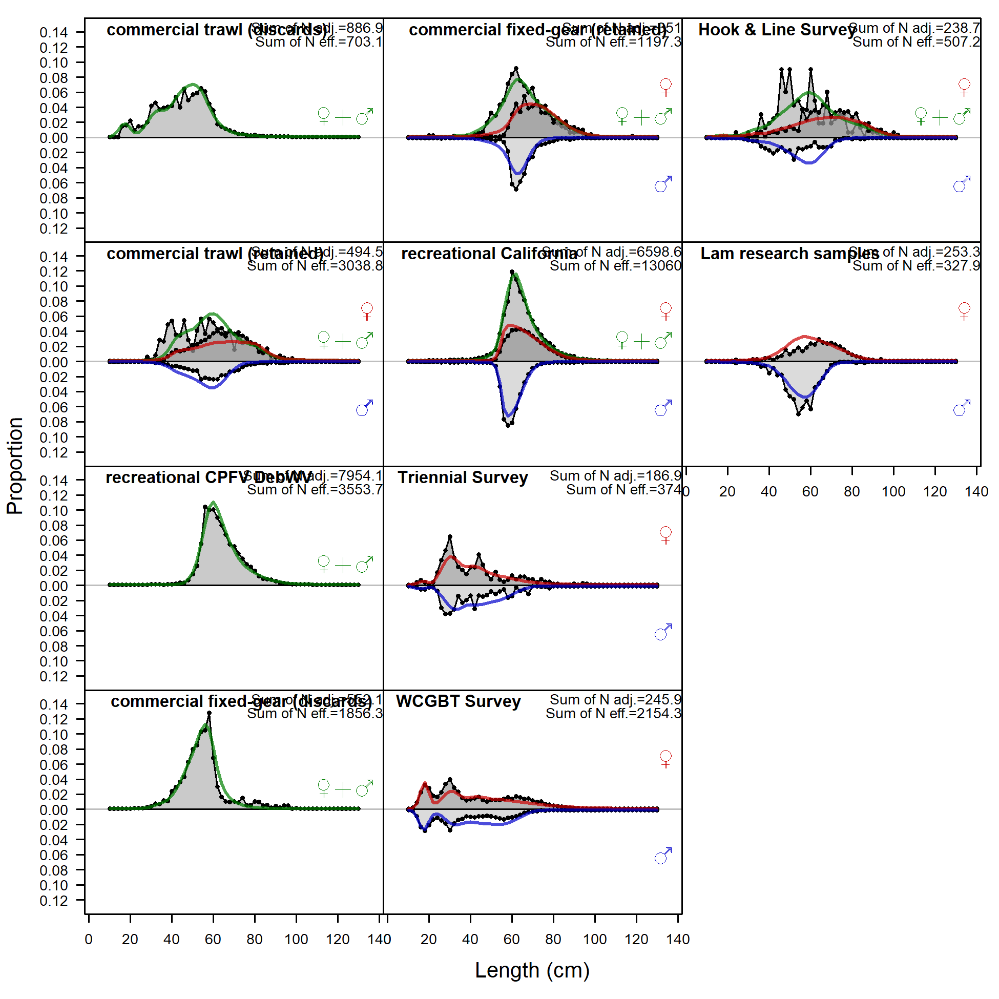
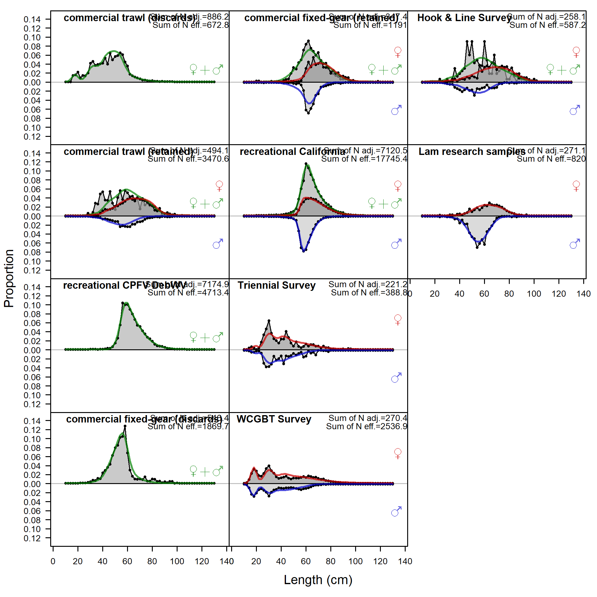
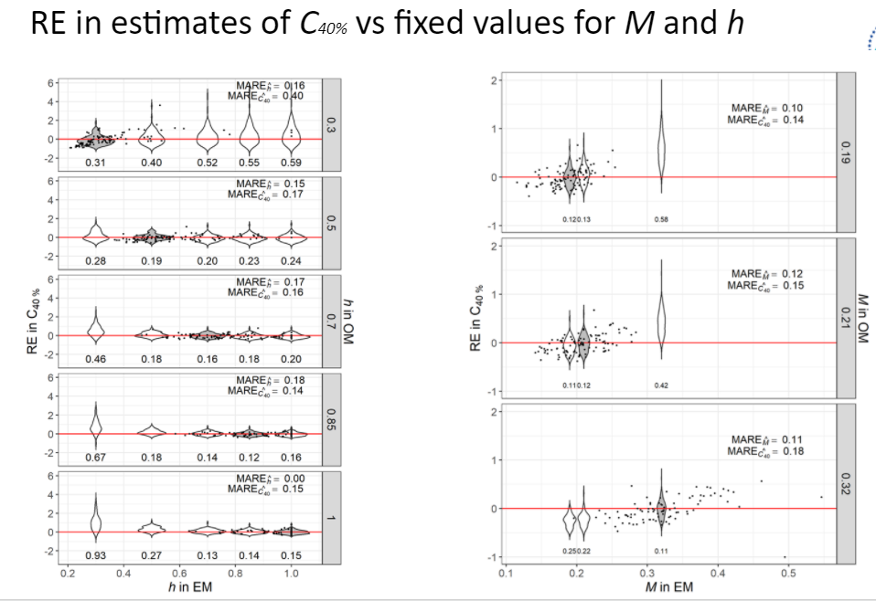

```{r setup, include=FALSE}
knitr::opts_chunk$set(
  echo = FALSE,
  message = FALSE,
  warning = FALSE,
  message = FALSE,
#   dev = "svg",
  fig.width = 12,
  fig.height = 12
  # fig.retina = 3
  )
xaringanthemer::style_mono_accent(
  # base_color = nmfspalette::nmfs_cols("darkblue"),
  base_color = "#00467F",
  header_font_google = xaringanthemer::google_font("Josefin Sans"),
  text_font_google   = xaringanthemer::google_font("Montserrat", "300", "300i"),
  code_font_google   = xaringanthemer::google_font("Fira Mono")
)
```

class: title-slide, inverse
```{css}
<style>
.center2 {
  margin: 0;
  position: absolute;
  top: 50%;
  left: 50%;
  -ms-transform: translate(-50%, -50%);
  transform: translate(-50%, -50%);
}
</style>
```
```{css}
.code-bg-white .remark-code, .code-bg-white .remark-code * {
 background-color:white!important;
}
```

.bg-text[
# Lingcod modeling and results
<hr />
Lingcod STAT<br><br>
July 12, 2021<br>
]

---
class: top

### Outline

This presentation will focus on three things:

- key diagnostics that were instrumental in the model selection process

- a subset of the sensitivities which provide useful information about the base models

- comparison of results for north and south models

More detailed model results and fits to data can be explored as needed using
the materials posted to https://iantaylor-noaa.github.io/Lingcod_2021/

???
Comments that are hidden.

---
class: top

### 2017 STAR panel recommendations

--

1. Cross-validate age-readings among labs and year

2. Acquire information from Canadian and Mexican authorities

3. Investigate stock structure

4. Concern for ages of unsexed fish being assigned equally to the sexes without regard for length

3. Perform a spatially-explicit stock assessment model

5. Fixed length at age 14 in North model

6. Estimate other key parameters, namely $M$ and $h$

7. Estimate area of habitat per area

---
class: top
### 2017 STAR panel recommendations

1. Cross-validate age-readings among labs and year

2. Acquire information from Canadian and Mexican authorities

3. Investigate stock structure

4. Concern for ages of unsexed fish being assigned equally to the sexes without regard for length

3. Perform a spatially-explicit stock assessment model

5. Fixed length at age 14 in North model: .noaablue[**estimated and performed likelihood profiles**]

6. Estimate other key parameters, namely $M$ and $h$: .noaablue[**estimated**]

7. Estimate area of habitat per area

---
layout: true
class: shuriken-300

.blade1.bg-blue[.content.center.vmiddle[
# .white[
Likelihood <br> profiles
]
]]
.blade2.bg-light-green[.content.vertical-rl.center[
# .blue[100 jitter iterations]
]]
.blade3.bg-light-blue[.content.center[
# .pink[Correlation of <br> Bayesian posteriors]
]]
.blade4.bg-green[.content.sideways-center.vmiddle[
# .yellow[Fits to the data]
]]
.hole.bg-white[.content.center.vmiddle[
{{content}}
]]
---

class: hide-blade1 hide-blade2 hide-blade3 hide-blade4

Diagnostics

---

class: hide-blade2 hide-blade3 hide-blade4
count: false

Diagnostics

---

class: hide-blade3 hide-blade4
count: false

Diagnostics

---

class: hide-blade4
count: false

Diagnostics

---

count: false

Diagnostics

---
layout: false

.blue[.large[Likelihood profiles <br> steepness for southern model]]
<br>
.pull-left[]
.pull-right[]

???
Profiles before and after removing age data provided insight into what parts of the data were informative.

---

.large[.pink[Correlation of <br> Bayesian posteriors]]
<br>
- Estimate posteriors using MCMC

- Autocorrelation
  - typically removed with thinning
  - more autocorrelation means higher uncertainty
  - effective sample size / number of samples quantifies 'mixing'
  - thinning will not help poorly defined models

- Identify inefficient parameters

???


---

### Sensitivity analyses

---

### North sensitivity to biology and recruitment
.pull-left-30[
- North model was not sensitive to most of these changes
- Largest change came from fixing female M = 0.3 and h = 0.7
- Base model estimates were M = 0.41 and h = 0.80
]

.pull-right-70[

]

---

### North sensitivity to biology and recruitment

<p style="margin-top:-25px;">
`r table_sens("../tables/sens_table_n_bio_rec.csv", caption = "", format = "html") %>%
      kableExtra::kable_styling(font_size = 12) 
`
---

### South sensitivity to biology and recruitment

.pull-left-30[
- South model was not sensitive to most of these changes
- Largest change came from fixing female M = 0.3 and h = 0.7
- Base model estimates were M = 0.26 and h = 0.54
]

.pull-right-70[

]

---

### South sensitivity to biology and recruitment
<p style="margin-top:-25px;">
`r table_sens("../tables/sens_table_s_bio_rec.csv", caption = "", format = "html") %>%
      kableExtra::kable_styling(font_size = 12) 
`
---

### North sensitivity to composition data

.pull-left-40[
- Dirichlet-multinomial likelihood:
  - increased weight on all comps
  - reduced fit to survey
  - reduced differentiation in weights among fleets
  

]

.pull-right-60[

]

---

### North sensitivity to composition data
<p style="margin-top:-25px;">
`r table_sens("../tables/sens_table_n_comp.csv", caption = "", format = "html") %>%
      kableExtra::kable_styling(font_size = 12) 
`
---

### South sensitivity to composition data

.pull-left-40[
- South model was sensitive to most changes in comp data
- D-M likelihood again increased comp weights
- Adding more age data pushed scale to implausibly high levels
  

]

.pull-right-60[

]

---

### South sensitivity to composition data
<p style="margin-top:-25px;">
`r table_sens("../tables/sens_table_s_comp.csv", caption = "", format = "html") %>%
      kableExtra::kable_styling(font_size = 12) 
`
---


### North sensitivity to index changes

.pull-left-40[
- fishery indices had biggest influence
- WA rec index has the longest time series
- OR CPFV sensitivity (not included in report) is using OR Rec index 
from onboard instead of dockside samples
- sensitivity to index removals is less than for the south model
]

.pull-right-60[

]

---

### North sensitivity to index changes
<p style="margin-top:-25px;">
`r table_sens("../tables/sens_table_n_index.csv", caption = "", format = "html") %>%
      kableExtra::kable_styling(font_size = 12) 
`
---

### South sensitivity to index changes

.pull-left-40[
- Larger impact from removing the CPFV DebWV index
- "no fishery indices" accidentally included the CPFV DebWV index
- "no fishery indices v2" (not included in report) excludes CPFV DebWV index
- CA CRFSPR sensitivity (not included in report) is using OR Rec index 
from onboard instead of dockside samples
- Larger impact from removing the Triennial survey

]

.pull-right-60[

]

---

### South sensitivity to index changes
<p style="margin-top:-25px;">
`r table_sens("../tables/sens_table_s_index.csv", caption = "", format = "html") %>%
      kableExtra::kable_styling(font_size = 12) 
`
---


### Additional sensitivities: selectivity & retention

An additional set of senstivities not included in the assessment reports:

1. make commercial fixed-gear fleet have asympotic selectivity
<br>(south only as north already had FG estimated asymptotic)

2. add an offset parameter to estimate sex-specific selectivity

3. sex-specific selectivity + fix female _M_ at 0.3

4. model retention prior to 1998 as equal to the current era (2011-onward) rather 
than retaining almost 100% of all fish

---

### North sensitivity to selectivity & retention

.pull-left-30[
- little sensitivity to retention assumption

- bigger impact of sex-specific selectivity (more details to follow)
]

<!-- to do: move selelectivity and retention figs into docs and add to HTML -->
.pull-right-70[

]

---

### North sensitivity to selectivity & retention
<p style="margin-top:-25px;">
`r table_sens("../tables/sens_table_n_sel.csv", caption = "", format = "html") %>%
      kableExtra::kable_styling(font_size = 12) 
`
---


### South sensitivity to selectivity & retention

.pull-left-30[
- small impact of making one fleet asymptotic

- big impact of retention assumption

- big impact of sex-specific selectivity
]

.pull-right-70[

]

---

### South sensitivity to selectivity & retention
<p style="margin-top:-25px;">
`r table_sens("../tables/sens_table_s_sel.csv", caption = "", format = "html") %>%
      kableExtra::kable_styling(font_size = 12) 
`

---


### North & South sensitivity to retention
.pull-left-40[
- Assuming early and late retention are equal has bigger impact on 
south model where discard rates are higher
- Estimated selectivity for the south in the early period is less plausible
with higher retention

]

.pull-right-60[

]
---

### North & South sex-specific selectivity

.pull-left[
<p style="margin-top:-50px;">
#### North
<p style="margin-top:-25px;">


]

.pull-right[
<p style="margin-top:-50px;">
#### South
<p style="margin-top:-25px;">


]

---

### South sex-specific selectivity
.pull-left[
<p style="margin-top:-50px;">
#### Base fit to aggregated length comps
<p style="margin-top:-25px;">

]
.pull-right[
<p style="margin-top:-50px;">
#### ... with sex-specific selectivity
<p style="margin-top:-25px;">

]

---

### Conclusions on selectivity & retention

- They provide useful information about tensions within the base models

- They show confounding between ratio of female to male _M_ and female to male
selectivity

- Some parameter estimates seem less plausible in each case

- None of these additional models appears as reasonable as the base models

---

### Castillo-Jordán et al. (in prep): key parameters



---

<!-- ### Comparison of areas: growth -->

### Comparison of areas: key parameters

.pull-left-40[
- Sex-specific natural mortality $M$ estimated with separate priors in both models
- Stock-recruit steepness $h$ estimated with informative prior for both models
- North model estimates associated with a more productive stock:
  - greater length-at-age (also more precisely estimated), 
  - higher $M$, and 
  - higher $h$

]

.pull-right-60[]

---

### Comparison of areas: quantities of interest
.pull-left-40[
- Unfished biomass more similar than would be expected given relative area
of the two regions
- Rough estimate is ~2.3x larger area in the north
- Fishing intensity in 2020 is similar in both regions
- Fraction unfished in 2021 is greater in the north than the south and more
precisely estimated
- MSY significantly larger in the north than the south
]
.pull-right-60[

]

---

### Concluding comments

- Both lingcod models are complex and challenging to understand individually
and in comparison with each other

- The base models resolve many of the issues raised in previous STAR panel
but raise new questions for future research

- Model scale is sensitive to a variety of assumptions

- Models fit indices well, indicating that we will be able to track changes in abundance

- Data suggest that the south is less productive than the north 

- Assuming equal values for mortality and steepness results in less 
plausible relative scale of the two models

- On the whole, both models should provide useful tools for managing these stocks
