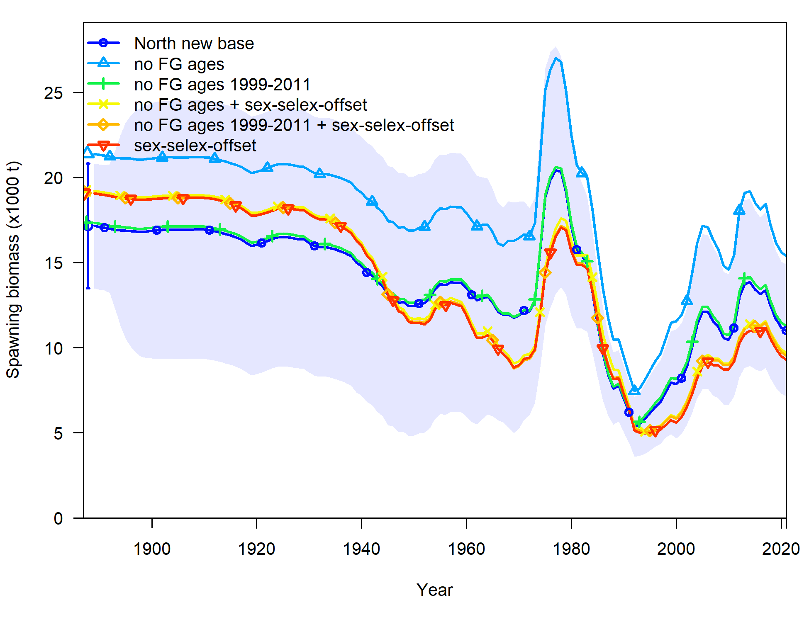
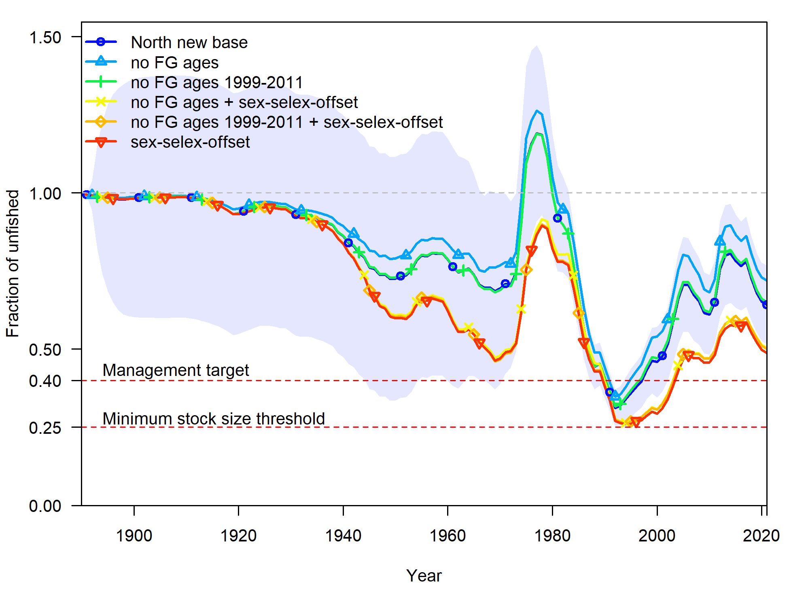
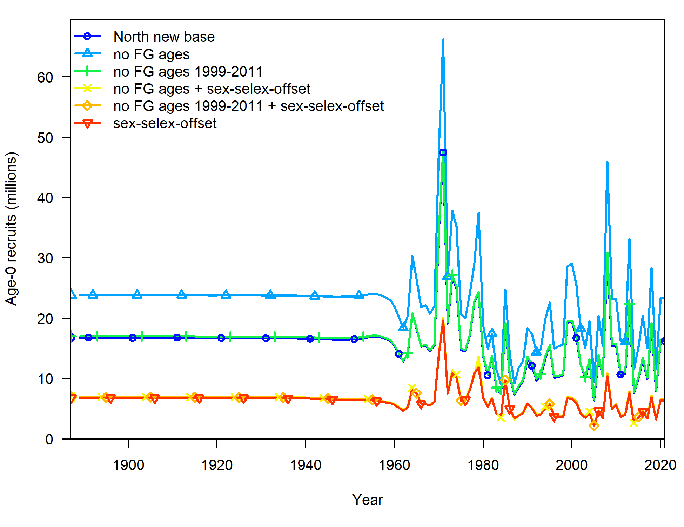
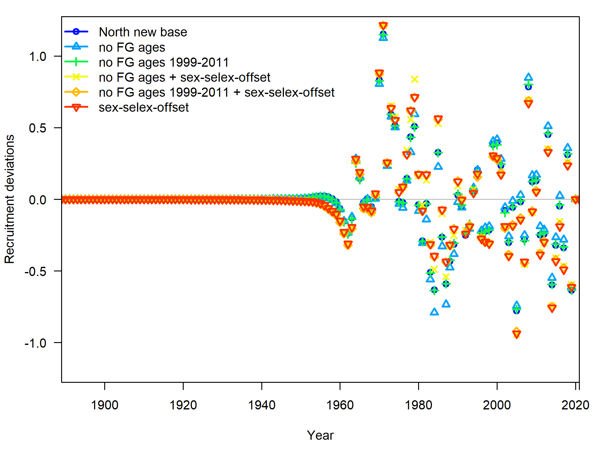
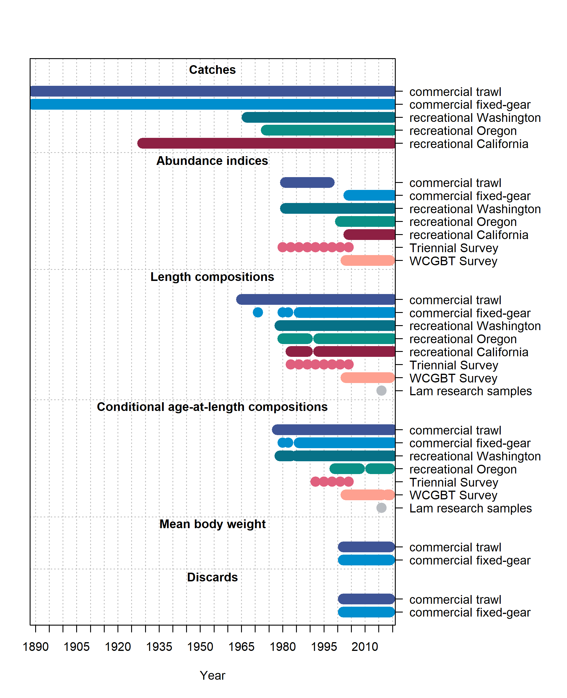
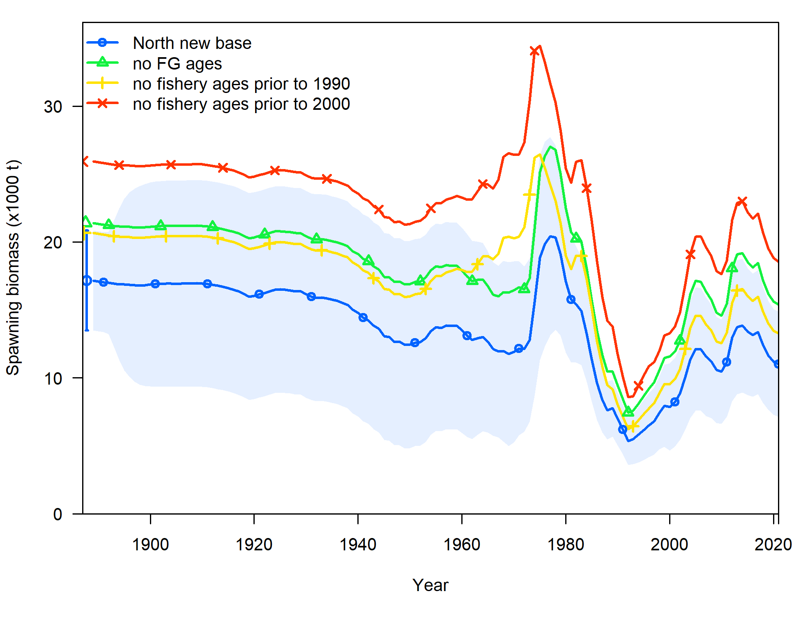
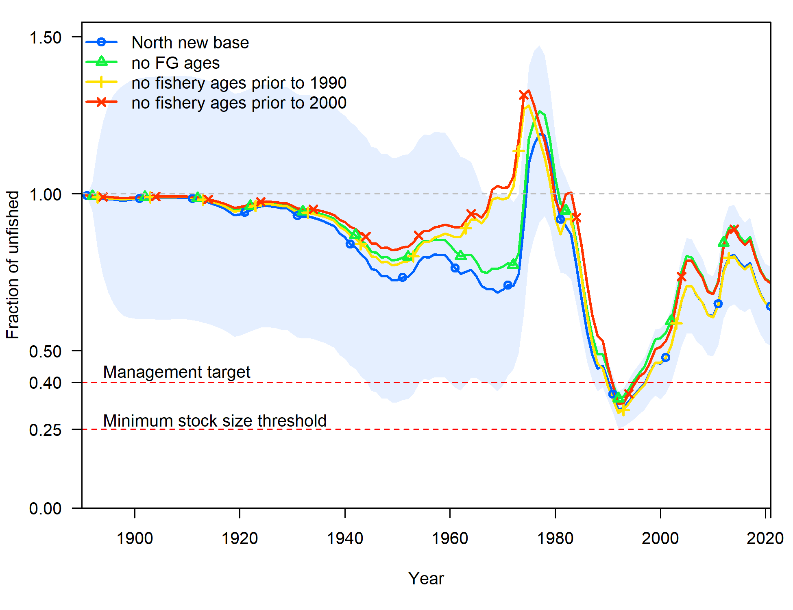
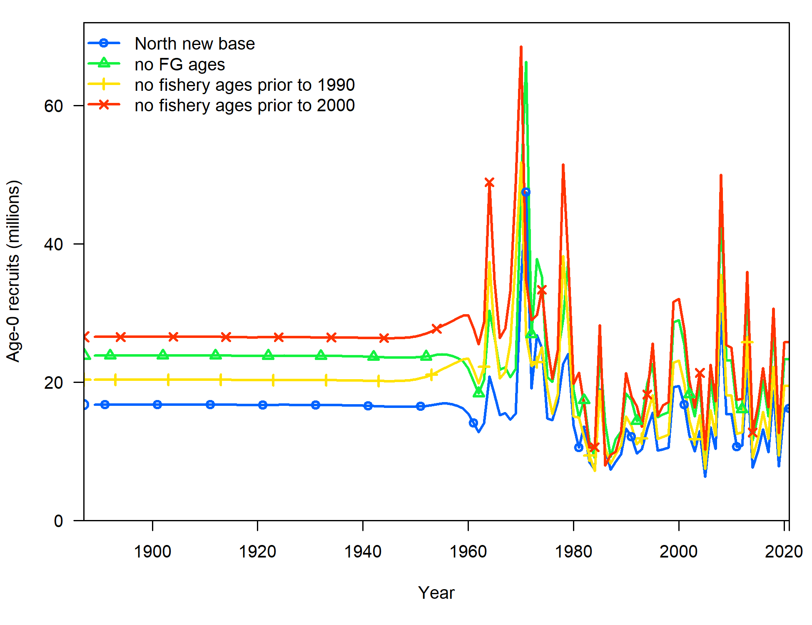
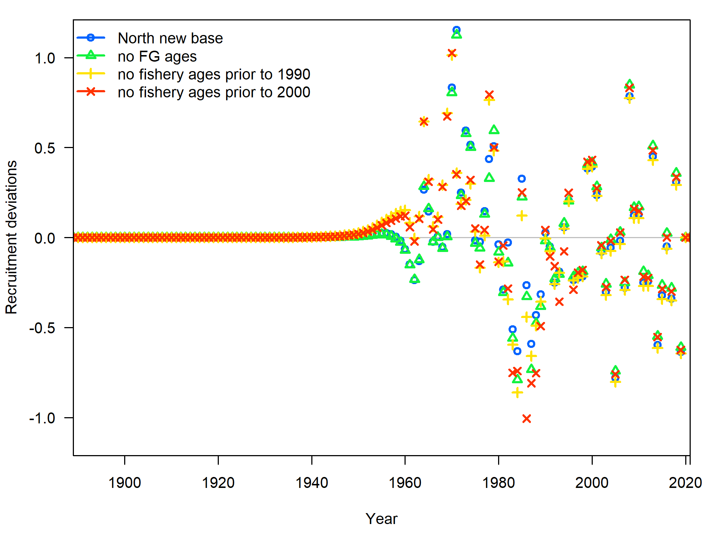

```{r setup, include=FALSE}
knitr::opts_chunk$set(
  echo = FALSE,
  message = FALSE,
  warning = FALSE,
  message = FALSE,
#   dev = "svg",
  fig.width = 12,
  fig.height = 12
  # fig.retina = 3
  )
xaringanthemer::style_mono_accent(
  # base_color = nmfspalette::nmfs_cols("darkblue"),
  base_color = "#00467F",
  header_font_google = xaringanthemer::google_font("Josefin Sans"),
  text_font_google   = xaringanthemer::google_font("Montserrat", "300", "300i"),
  code_font_google   = xaringanthemer::google_font("Fira Mono")
)
```

class: title-slide, inverse
```{css}
<style>
.center2 {
  margin: 0;
  position: absolute;
  top: 50%;
  left: 50%;
  -ms-transform: translate(-50%, -50%);
  transform: translate(-50%, -50%);
}
</style>
```
```{css}
.code-bg-white .remark-code, .code-bg-white .remark-code * {
 background-color:white!important;
}
```

.bg-text[
# Lingcod sandbox
<hr />
Lingcod STAT<br><br>
July 12, 2021<br>
]

---

# STAR Request 8

### A) Remove all fixed gear age composition data. B) Remove fixed gear age composition data for the years 1999-2011. C) Do A and B with and without offsets for sex-based selectivity for all fleets. Requests are for North only model. Provide the model comparisons slides and table(s) with likelihoods and key parameter outputs, selectivity outputs, etc. The STAT will include the updated results from Day 2, Request 5.

---

### STAR Request 8

.pull-left[

]

.pull-right[

]

---

### STAR Request 8

.pull-left[

]

.pull-right[

]

---

### STAR Request 8
<p style="margin-top:-25px;">
`r table_sens("../tables/sens_table_n_star08.csv", 
              caption = "", format = "html") %>%
      kableExtra::kable_styling(font_size = 12) 
`
---

### STAR Request 8 extras
.pull-left-40[
Request 8 showed little impact of removing the fixed-gear ages from 1999-2011 
but large impact from removing all fixed-gear ages.

This suggests that there may be some conflict in the model related to either
the recent ages from 2012-onward or prior to 1999.

We tested the impact of removing early ages from all fisheries 
either prior to 1990 or prior to 2000.

.pull-right-60[

]

---

### STAR Request 8 extras

.pull-left[

]

.pull-right[

]

---

### STAR Request 8

.pull-left[

]

.pull-right[

]

---

### STAR Request 8 extras
<p style="margin-top:-25px;">
`r table_sens("../tables/sens_table_n_star08_extras.csv", 
              caption = "", format = "html") %>%
      kableExtra::kable_styling(font_size = 12) 
`
---

