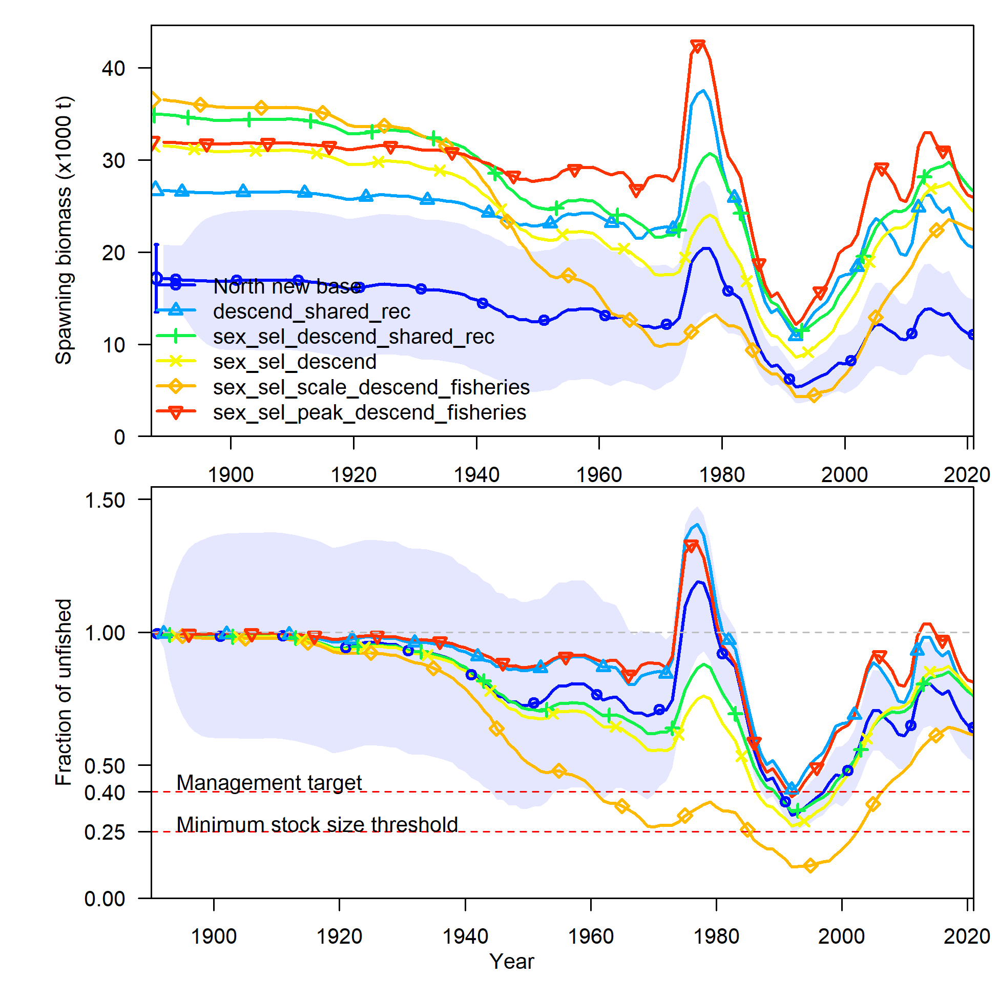

```{r setup, include=FALSE}
knitr::opts_chunk$set(
  echo = FALSE,
  message = FALSE,
  warning = FALSE,
  message = FALSE,
#   dev = "svg",
  fig.width = 12,
  fig.height = 12
  # fig.retina = 3
  )
xaringanthemer::style_mono_accent(
  # base_color = nmfspalette::nmfs_cols("darkblue"),
  base_color = "#00467F",
  header_font_google = xaringanthemer::google_font("Josefin Sans"),
  text_font_google   = xaringanthemer::google_font("Montserrat", "300", "300i"),
  code_font_google   = xaringanthemer::google_font("Fira Mono")
)
```

class: title-slide, inverse
```{css}
<style>
.center2 {
  margin: 0;
  position: absolute;
  top: 50%;
  left: 50%;
  -ms-transform: translate(-50%, -50%);
  transform: translate(-50%, -50%);
}
</style>
```
```{css}
.code-bg-white .remark-code, .code-bg-white .remark-code * {
 background-color:white!important;
}
```

.bg-text[
# Lingcod sandbox
<hr />
Lingcod STAT<br><br>
July 12, 2021<br>
]

---

# STAR Request 12

Process: start by simplifying the selectivity parameterization and and then add back additional
parameters, including sex-specific offsets in order to find a good balance between 
adequate fits to the data, reasonable selectivity shapes, and reasonable overall results.

The north base model has several fixed parameters controlling dome-shaped selectivity,
all these were freed up before the explorations to allow things to become domed as needed.

No re-tuning was done.

---

# STAR Request 12
<small>

sens_number | description
--- | ---
413_asymptotic_TW | fix the commercial trawl selectivity to be asymptotic for all blocks 
414_descend_shared_across_blocks | make the descending slope of the selectivity function equal for all blocks 
415_sex_sel_descend_shared | make the descending slope of the selectivity function sex-specific and equal for all blocks 
416_descend_shared_rec | make the descending slope of the selectivity function equal for all blocks within the rec fleets 
417_sex_sel_descend_shared_rec | make the descending slope of the selectivity function sex-specific and equal for all blocks within the rec fleets  
419_sex_sel_descend | make the descending slope of the selectivity function sex-specific
420_sex_sel_scale_descend_fisheries | make the scale and descending slope of the selectivity function sex-specific for fisheries only
421_sex_sel_peak_descend_fisheries | make the peak and descending slope of the selectivity function sex-specific for fisheries only

</small>
---

### STAR Request 12

.pull-left-30[
]

.pull-right-70[

]

---

### STAR Request 12

<p style="margin-top:-30px;">
`r table_sens("../tables/sens_table_n_star12.csv", 
              caption = "", format = "html") %>%
      kableExtra::kable_styling(font_size = 12) 
`

---

### STAR Request 12

Now dynamically show additional figures of selectivity estimates not included in presentation.
