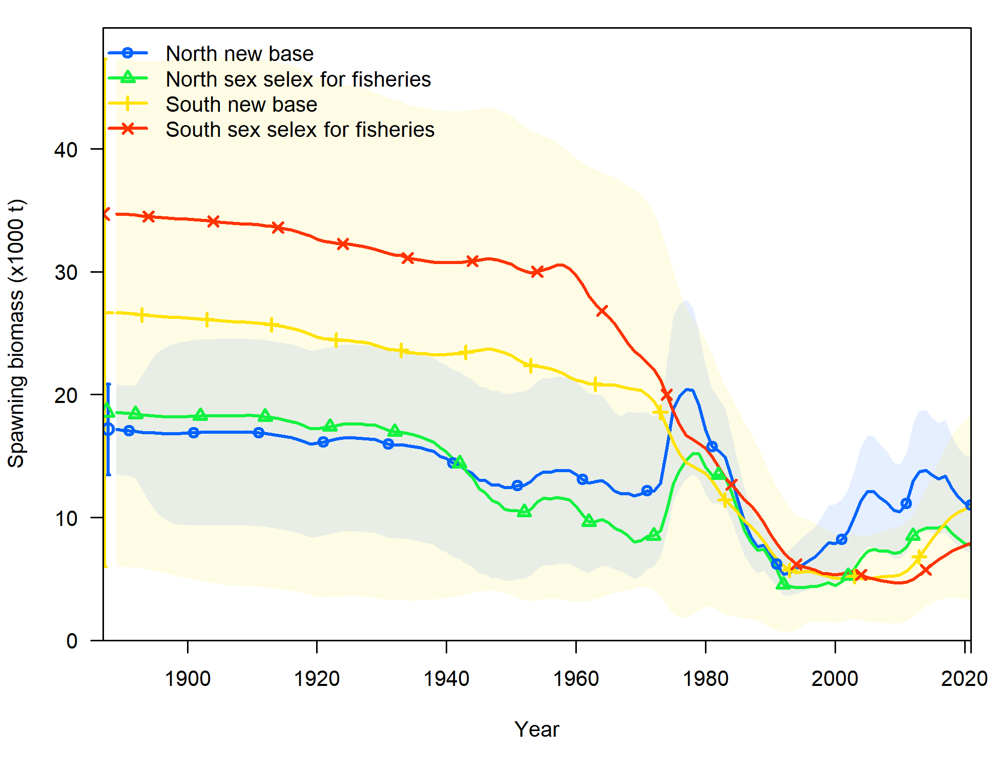
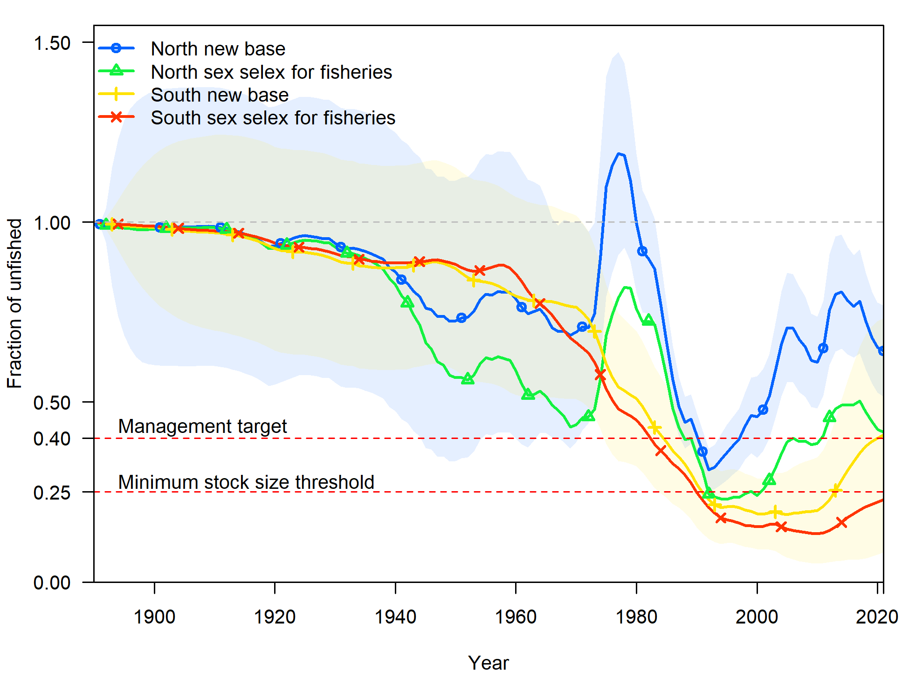
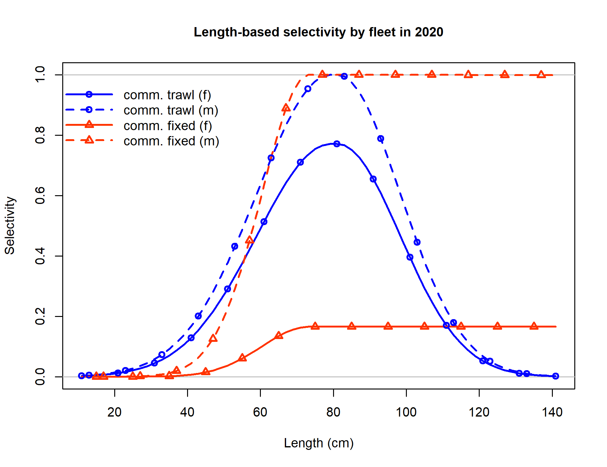
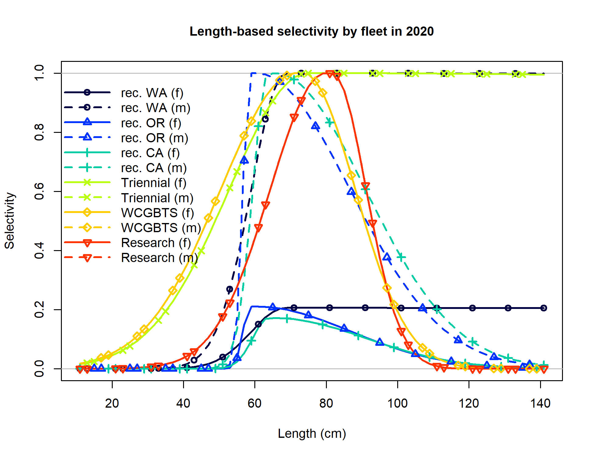
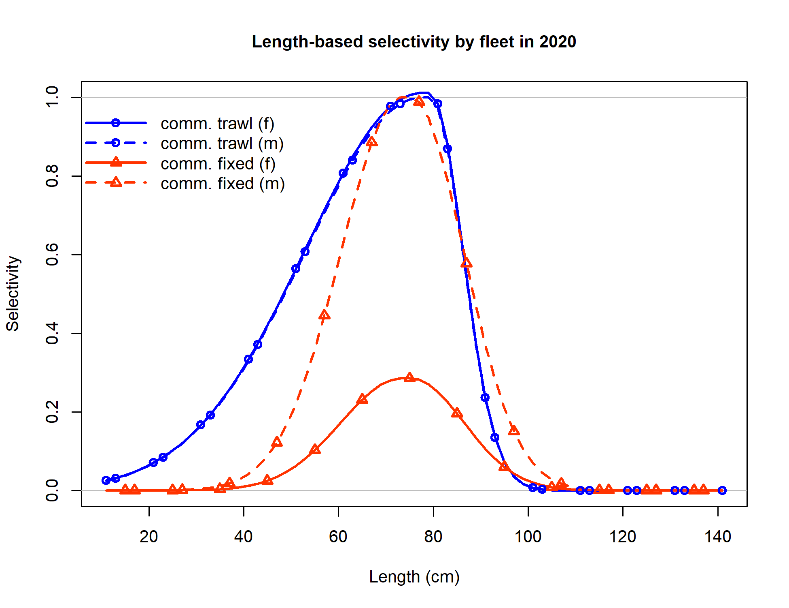
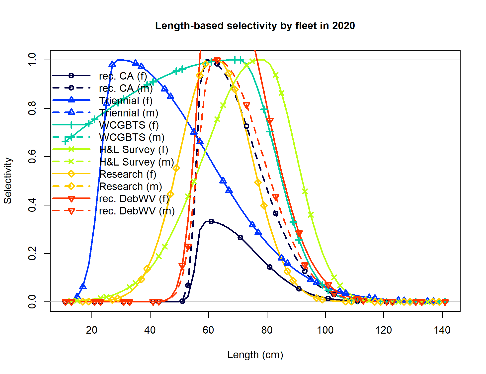

```{r setup, include=FALSE}
knitr::opts_chunk$set(
  echo = FALSE,
  message = FALSE,
  warning = FALSE,
  message = FALSE,
#   dev = "svg",
  fig.width = 12,
  fig.height = 12
  # fig.retina = 3
  )
xaringanthemer::style_mono_accent(
  # base_color = nmfspalette::nmfs_cols("darkblue"),
  base_color = "#00467F",
  header_font_google = xaringanthemer::google_font("Josefin Sans"),
  text_font_google   = xaringanthemer::google_font("Montserrat", "300", "300i"),
  code_font_google   = xaringanthemer::google_font("Fira Mono")
)
```

class: title-slide, inverse
```{css}
<style>
.center2 {
  margin: 0;
  position: absolute;
  top: 50%;
  left: 50%;
  -ms-transform: translate(-50%, -50%);
  transform: translate(-50%, -50%);
}
</style>
```
```{css}
.code-bg-white .remark-code, .code-bg-white .remark-code * {
 background-color:white!important;
}
```

.bg-text[
# Lingcod sandbox
<hr />
Lingcod STAT<br><br>
July 12, 2021<br>
]

---

# STAR Request 11

### Request:
Perform runs for both the north and south base models in which sex-specific
selectivity offsets are implemented for fisheries but not surveys. Explore other
parameterizations of the selectivity offset as time might allow. Provide the model
comparisons slides and tables/figures with likelihoods and key parameter outputs,
selectivity outputs, etc. for panel review

### Rationale:
The STAT has observed that the selectivity differences appear to be greater for the fisheries
data relative to the survey data, and has been considering alternative forms of implementing
the selectivity offsets.

---

### STAR Request 11

.pull-left[

]

.pull-right[

]

---

### STAR Request 11
.pull-left[
<p style="margin-top:-25px;">
North selectivity


]

.pull-right[
<p style="margin-top:-25px;">
South selectivity


]

---

### STAR Request 11
.pull-left[
<p style="margin-top:-25px;">
`r table_sens("../tables/sens_table_n_star11.csv", 
              caption = "", format = "html") %>%
      kableExtra::kable_styling(font_size = 12) 
`
]

.pull-right[
<p style="margin-top:-25px;">
`r table_sens("../tables/sens_table_s_star11.csv", 
              caption = "", format = "html") %>%
      kableExtra::kable_styling(font_size = 12) 
`
]


---


