```{r setup, include=FALSE}
knitr::opts_chunk$set(
  echo = FALSE,
  message = FALSE,
  warning = FALSE,
  message = FALSE,
#   dev = "svg",
  fig.width = 12,
  fig.height = 12
  # fig.retina = 3
  )
xaringanthemer::style_mono_accent(
  # base_color = nmfspalette::nmfs_cols("darkblue"),
  base_color = "#00467F",
  header_font_google = xaringanthemer::google_font("Josefin Sans"),
  text_font_google   = xaringanthemer::google_font("Montserrat", "300", "300i"),
  code_font_google   = xaringanthemer::google_font("Fira Mono"),
  colors = c(noaablue = "#00467F")
)
```

class: title-slide, inverse
```{css}
<style>
.center2 {
  margin: 0;
  position: absolute;
  top: 50%;
  left: 50%;
  -ms-transform: translate(-50%, -50%);
  transform: translate(-50%, -50%);
}
</style>
```
```{css}
.code-bg-white .remark-code, .code-bg-white .remark-code * {
 background-color:white!important;
}
```

.bg-text[
# Responses to STAR requests from day 1

## Sex-specific selectivity, Deb WV index, recruitment, discards

<hr />
Lingcod STAT<br><br>
July 13, 2021<br>
]

---

# 01

<!-- @iantaylor-noaa @kellijohnson-noaa -->

### Request: Explore freeing up the width parameter on sex specific selectivity curves, including offsets, for trawl North, trawl South, and fixed gear South. Do not have this parameter time varying. This exploration will be for North and South. Provide likelihood profiles for M on the age and length data. The range of M are to be for female 0.18 to 0.58 in steps of 0.05.

### Short response: Estimating the width parameter for sex-specific selectivity curves had little to no effect on the model results.

---

```{r req01fig, include = TRUE, echo = FALSE, cache = TRUE, eval = FALSE}
basemodeloutput <- r4ss::SSgetoutput(dirvec = file.path("..", "models", info_basemodels))
output1 <- r4ss::SSgetoutput(
  getcovar = FALSE,
  dirvec = file.path("..", "models", c(info_basemodels, "2021.n.022.408_female_sel_offset_flattop", "2021.s.014.407_female_sel_offset_flattop"))
)
outputsummarized1 <- r4ss::SSsummarize(c(basemodeloutput[1], output1[1], basemodeloutput[2], output1[4])
labels1 <- c("North", "North flat top", "South", "South flat top")
r4ss::SSplotComparisons(outputsummarized1, legendlabels = labels1, subplots = 1)
```
#### 01 North & South sex-specific selectivity

(3-param above, 4-param with flat top below)
.pull-left[
<p style="margin-top:-50px;">
#### North 
<p style="margin-top:-25px;">
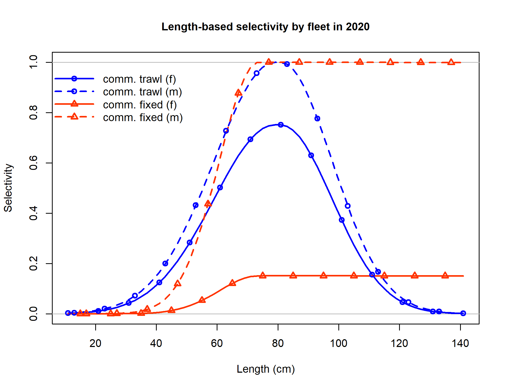
]

.pull-right[
<p style="margin-top:-50px;">
#### South
<p style="margin-top:-25px;">

]

---
#### 01 North & South sex-specific selectivity


(3-param above, 4-param with flat top below)
.pull-left[
<p style="margin-top:-50px;">
#### North 
<p style="margin-top:-25px;">
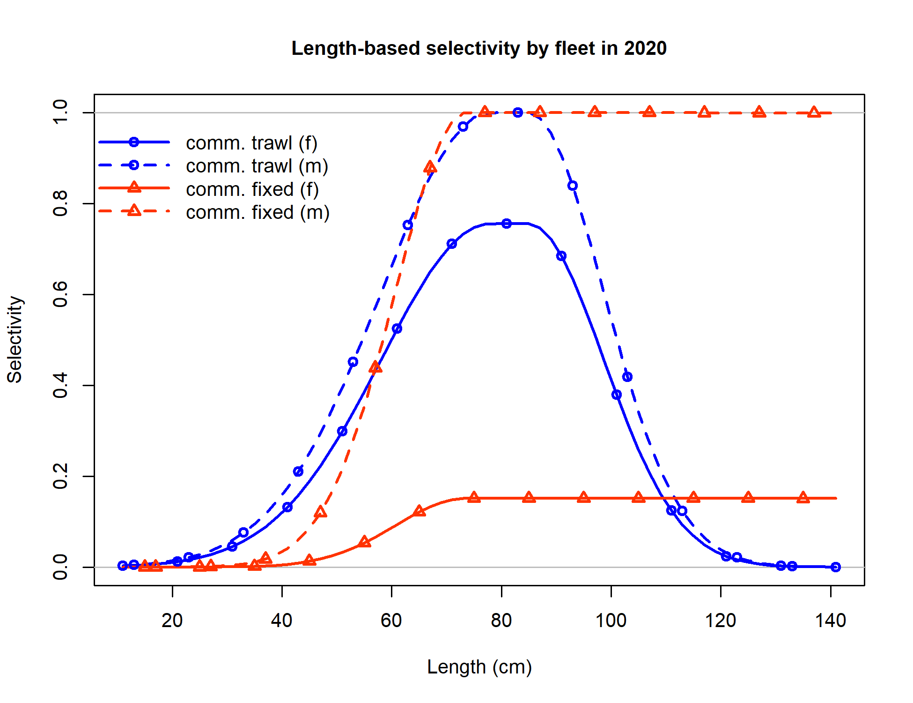
]

.pull-right[
<p style="margin-top:-50px;">
#### South
<p style="margin-top:-25px;">
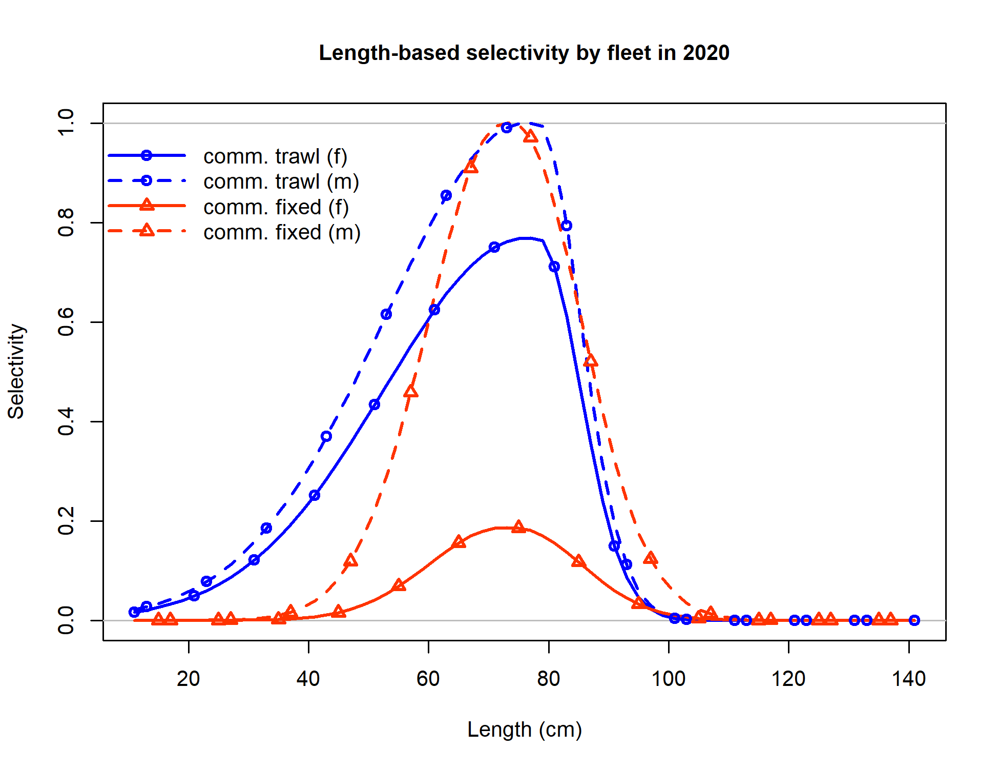
]
---

# 01

### Profiles from flat-topped selectivity

.pull-left[North<br>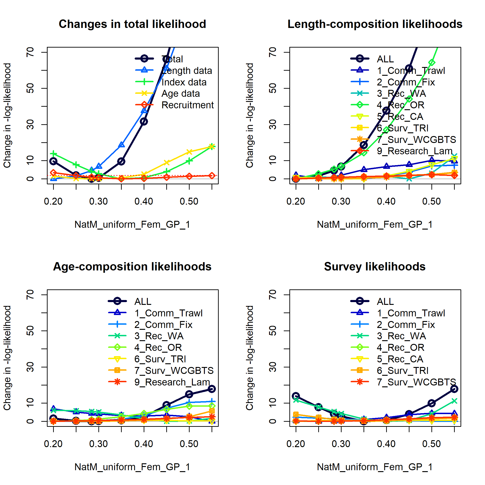]
.pull-right[South<br>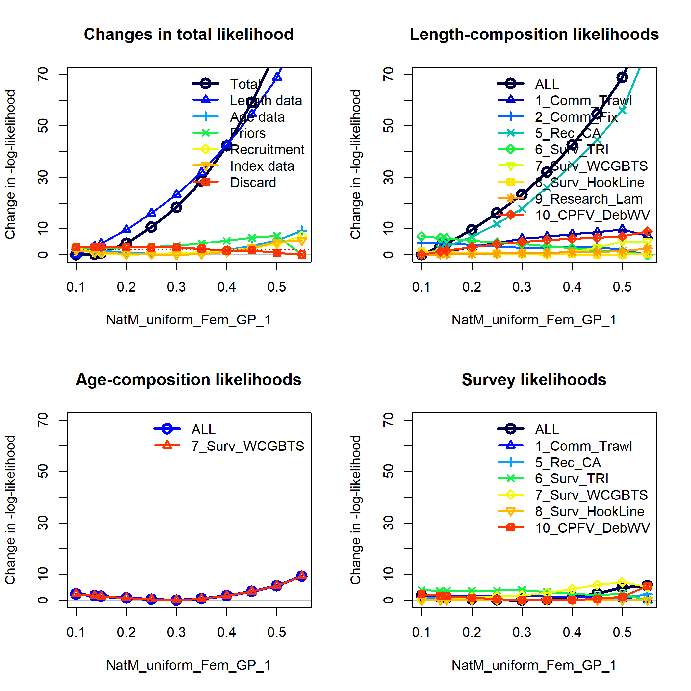]

---

# 02

### Request: Model run and the fit to the DWV index when that index has no influence on the model. Compare results to the fit that includes index. Provide model comparison figures. This request is only for the South model.

<!-- @iantaylor-noaa @kellijohnson-noaa -->
```{r req01code, eval = FALSE}
run_sensitivities(get_dir_ling("s", 14),
  type = c("sens_create", "sens_run"),
  numbers = c(803)
)
```

---

# 02

```{r req02fig, include = FALSE, echo = FALSE, eval = FALSE, cache = TRUE}
output2 <- r4ss::SSgetoutput(
  getcovar = FALSE,
  dirvec = file.path("..", "models", c("2021.s.014.320_no_CPFV_DebWV_index", "2021.s.014.803_no_CPFV_DebWV_indexorlengths"))
)
outputsummarized2 <- r4ss::SSsummarize(c(basemodeloutput[2], output2))
labels2 <- c("South", "No Deb WV index", "No Deb WV index or lengths")
r4ss::SSplotComparisons(
  outputsummarized2,
  legendlabels = labels2,
  plotdir = '../figures/STAR_Day1_request2',
  print = TRUE, plot = FALSE
)
```
.pull-left[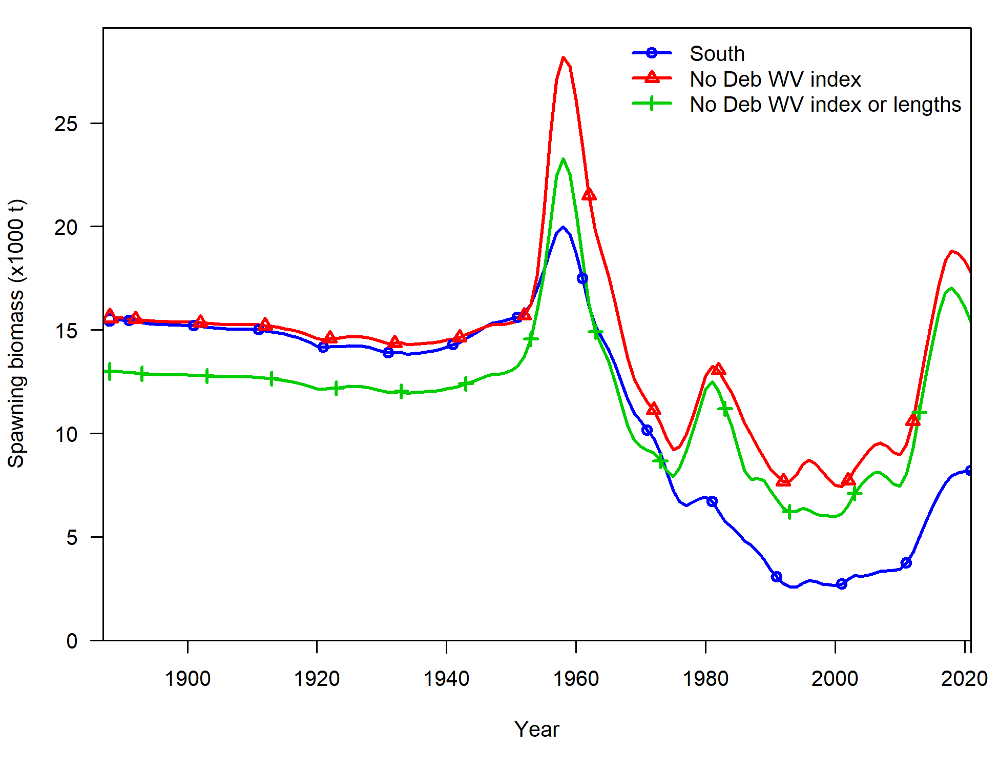]
.pull-right[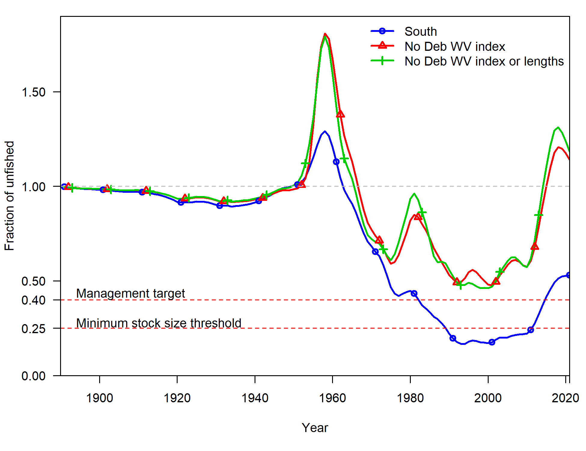]

---
# 02 - Commercial trawl

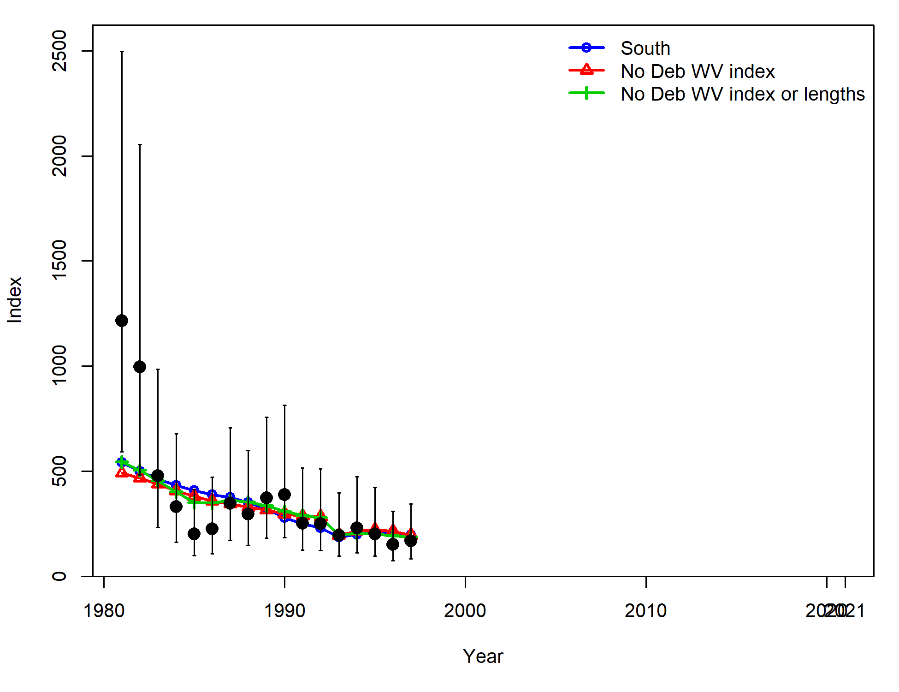

---
# 02 - Triennial Survey

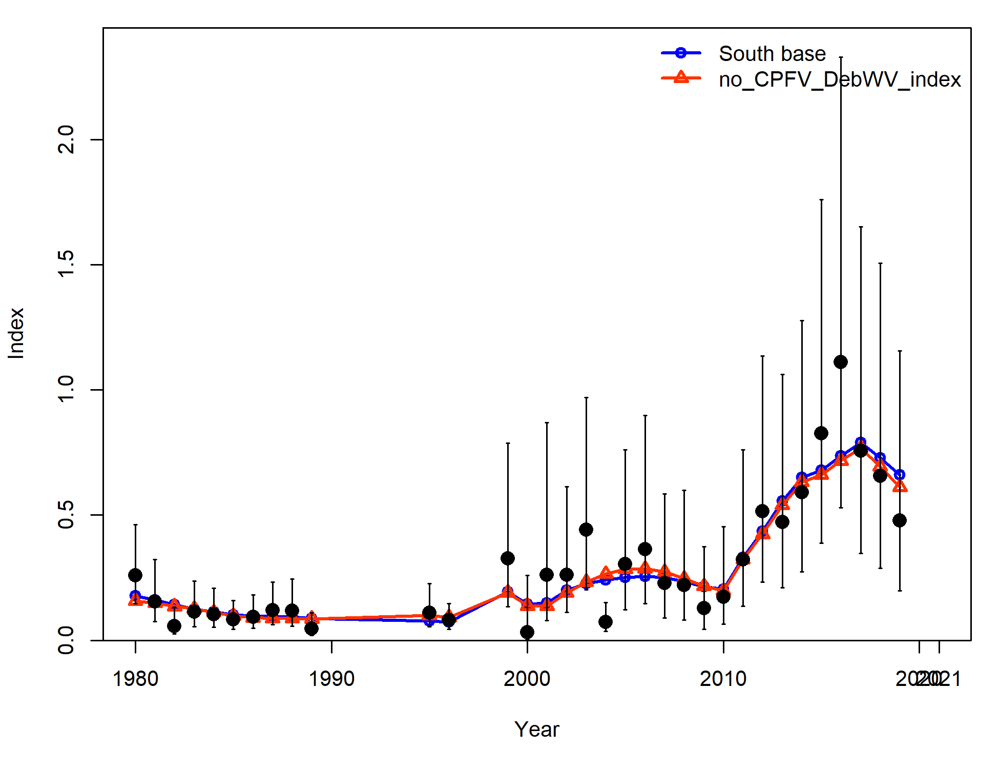

---
# 02 - WCGBTS

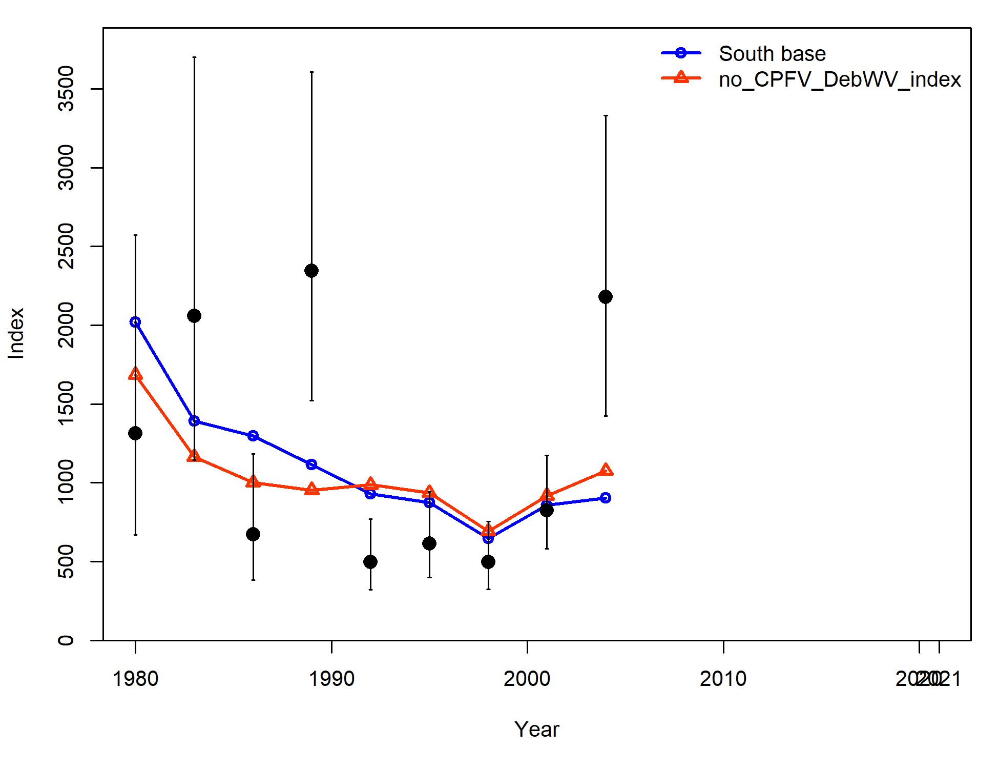

---
# 02 - Hook and Line Survey

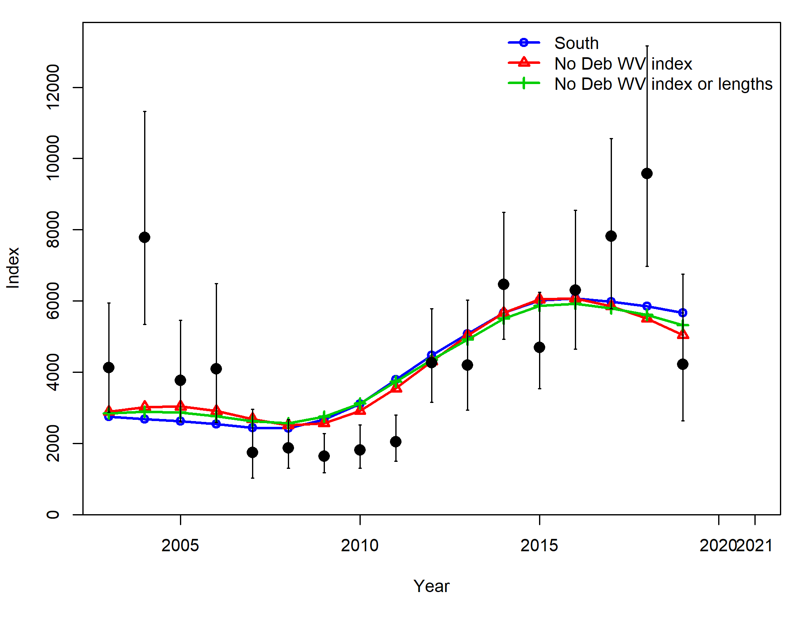

---
# 02 - Lam Research


---
# 02 - Deb WV index fits

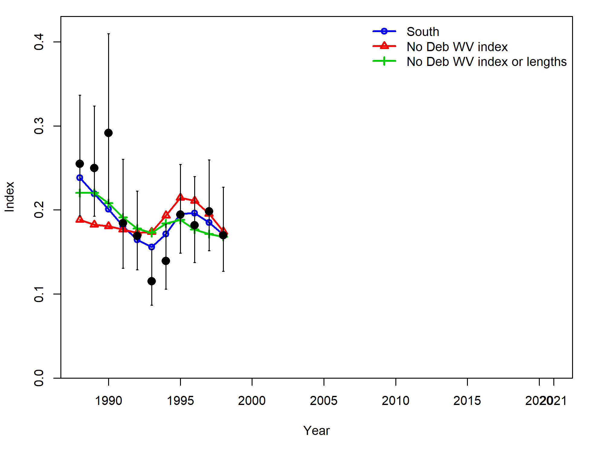


---

# 03

<!-- issue #139 -->
<!-- @brianlangseth-noaa @kellijohnson-noaa -->

### Request: Run the southern model with main recdevs starting in 1955. Produce model comparison results and dynamic $B_0$ for both models. If the early devs are still 'unusually' high (comparable to what is seen in the base model at present), turn off the early devs for a 3rd run if time allows.

### Short response: Changing the start of the main year had almost no effect on the model results. Early CA recreational data are informing recruitment.

```{r req02code, eval = FALSE}
dir1955 <- file.path("models", "2021.s.014.802_esth_changerecdevperiod")
r4ss::copy_SS_inputs(
  dir.old = file.path("models", info_basemodels[2]),
  dir.new = dir1955,
  overwrite = TRUE,
  recursive = FALSE,
  use_ss_new = FALSE,
  copy_exe = TRUE,
  verbose = FALSE
)

starter <- r4ss::SS_readstarter(file.path(dir1955, "starter.ss"))
dat <- r4ss::SS_readdat(file.path(dir1955, starter$datfile))
ctl <- r4ss::SS_readctl(
  file.path(dir1955, starter$ctlfile),
  use_datlist = TRUE, datlist = dat
)
ctl[["MainRdevYrFirst"]] <- 1955
r4ss::SS_writectl(ctl, file.path(dir1955, starter$ctlfile), overwrite = TRUE)
r4ss::run_SS_models(dirvec = file.path(dir1955))

output <- r4ss::SS_output(file.path(dir1955))
r4ss::SS_plots(output)
r4ss::SS_fitbiasramp(output, print = TRUE,
  oldctl = file.path(dir1955, starter$ctl),
  newctl = file.path(dir1955, "control_bias.ss")
)

dirrm1975 <- file.path("models", "2021.s.014.805_esth_removecomp1975")
r4ss::copy_SS_inputs(
  dir.old = file.path("models", info_basemodels[2]),
  dir.new = dirrm1975,
  overwrite = TRUE,
  recursive = FALSE,
  use_ss_new = FALSE,
  copy_exe = TRUE,
  verbose = FALSE
)
starter <- r4ss::SS_readstarter(file.path(dirrm1975, "starter.ss"))
dat <- r4ss::SS_readdat(file.path(dirrm1975, starter$datfile))
ctl <- r4ss::SS_readctl(
  file.path(dirrm1975, starter$ctlfile),
  use_datlist = TRUE, datlist = dat
)
removedcomp <- dat$lencomp %>%
  dplyr::filter(Yr < 1975)
dat$lencomp <- dat$lencomp %>%
  dplyr::filter(Yr >= 1975)
ctl[["MainRdevYrFirst"]] <- ctl[["MainRdevYrFirst"]] + 15
r4ss::SS_writedat(
  overwrite = TRUE,
  dat, file.path(dirrm1975, starter$dat)
)
r4ss::SS_writectl(
  overwrite = TRUE,
  ctl, file.path(dirrm1975, starter$ctl)
)
r4ss::run_SS_models(dirvec = file.path(dirrm1975))
output <- r4ss::SS_output(dirrm1975)
r4ss::SS_fitbiasramp(output, print = TRUE,
  oldctl = file.path(dirrm1975, starter$ctl),
  newctl = file.path(dirrm1975, "control_bias.ss")
)
dirrm1975adjusted <- file.path("models", "2021.s.014.806_esth_removecomp1975adjusted")
r4ss::copy_SS_inputs(
  dir.old = dirrm1975,
  dir.new = dirrm1975adjusted,
  overwrite = TRUE,
  recursive = FALSE,
  use_ss_new = FALSE,
  copy_exe = TRUE,
  verbose = FALSE
)
file.copy(file.path(dirrm1975, "control_bias.ss"), file.path(dirrm1975adjusted, starter$ctl), overwrite = TRUE)
r4ss::run_SS_models(dirvec = file.path(dirrm1975adjusted))
```

---

# 03 Time series

```{r req03fig, echo = FALSE, cache = TRUE, include = FALSE, eval = TRUE}
output3 <- r4ss::SSgetoutput(
  getcovar = FALSE,
  dirvec = file.path("..", "models", 
    c(
      "2021.s.014.802_esth_changerecdevperiod",
      # "2021.s.014.803_no_earlyDevs",
      "2021.s.014.804_no_earlyDevs_biasAdj",
      # "2021.s.014.805_esth_removecomp1975",
      "2021.s.014.806_esth_removecomp1975adjusted"
    )
  )
)
outputsummarized3 <- r4ss::SSsummarize(c(basemodeloutput[2], output3))
labels3 <- c("South", "Rec dev main == 1955", "No early devs", "First year comp == 1975")
r4ss::SSplotComparisons(
  outputsummarized3,
  legendlabels = labels3,
  subplots = c(1,3,10),
  plotdir = '../figures/STAR_Day1_request3',
  print = TRUE, plot = FALSE
)
```
.pull-left[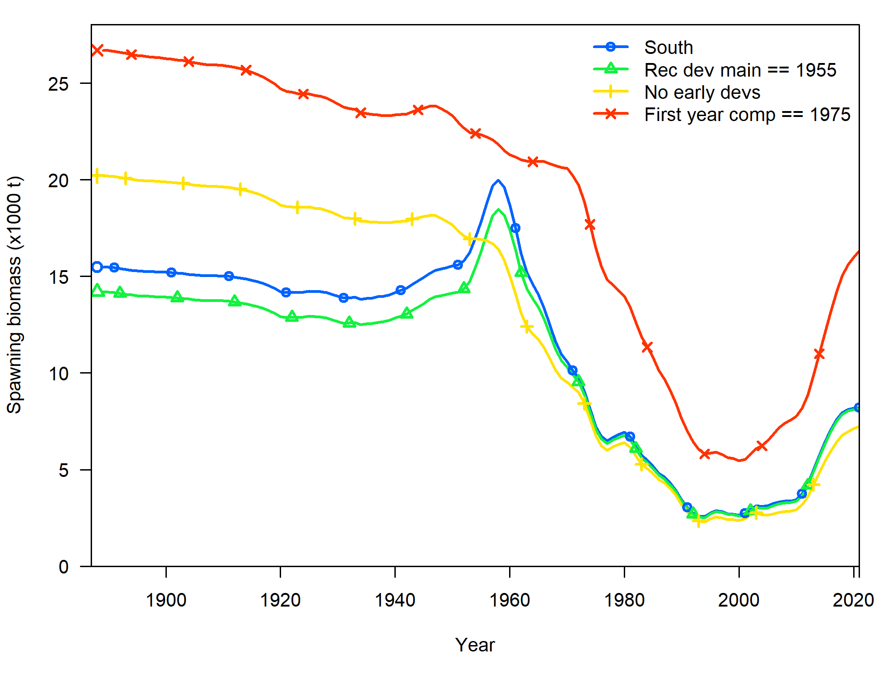]
.pull-right[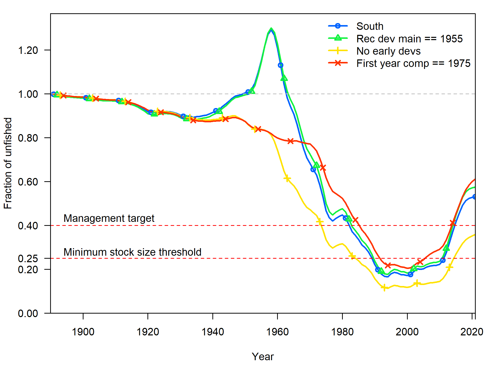]

---

# 03 Estimated recruitment

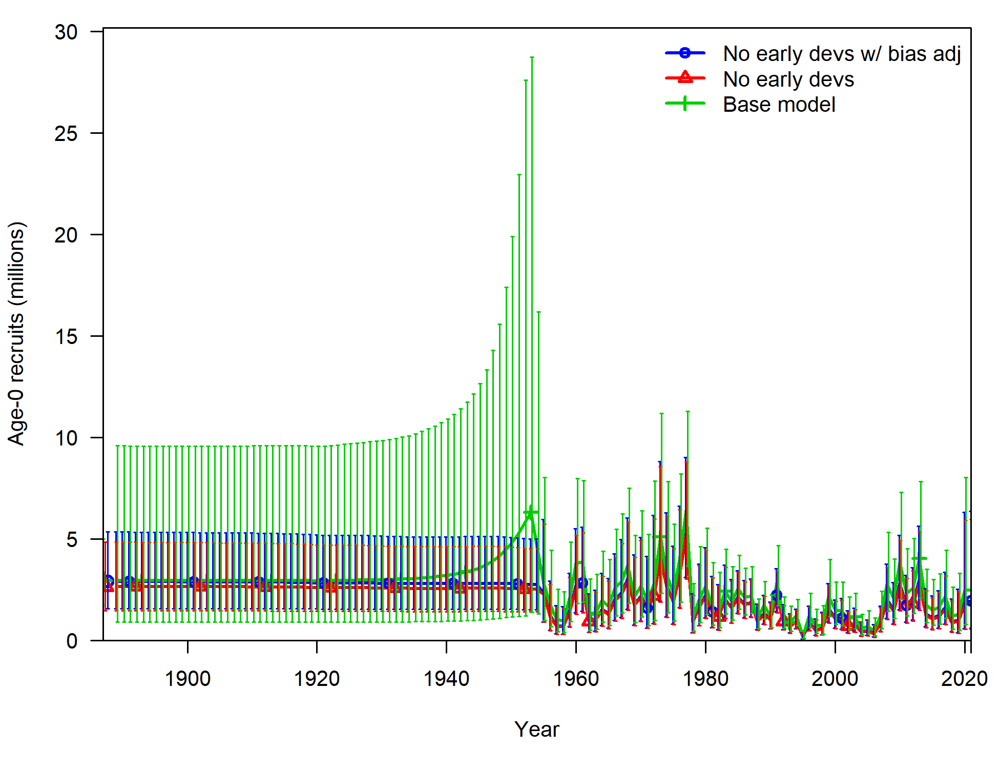

---

# 03 - Dynamic $B_0$

```{r, fig.height=8}
bzeroinfo <- c(basemodeloutput[2], output3)
names(bzeroinfo) <- labels3
lapply(bzeroinfo, "[[", "Dynamic_Bzero") %>% dplyr::bind_rows(.id = "model") %>%
ggplot2::ggplot(ggplot2::aes(Yr,SSB,group=model,col=model)) +
ggplot2::theme_bw() + ggplot2::geom_line(size = 1.5) +
ggplot2::geom_line(ggplot2::aes(y = SSB_nofishing), lty = 2, size = 1.5) +
ggplot2::scale_color_manual(values = c("purple", "green", "yellow", "red")) +
  ggplot2::theme(
    text = ggplot2::element_text(size=20),
    strip.background = ggplot2::element_rect(colour = "black", fill = "white"),
    legend.position = "top"
  )
```
---

# 04

<!-- @brianlangseth-noaa -->

### Request: Provide removals (i.e., total dead discards and total retained catch) by fleet and disposition by year for both North and South. STAT discretion on display of data - figure or table.

---

# 04

.pull-left[North<br>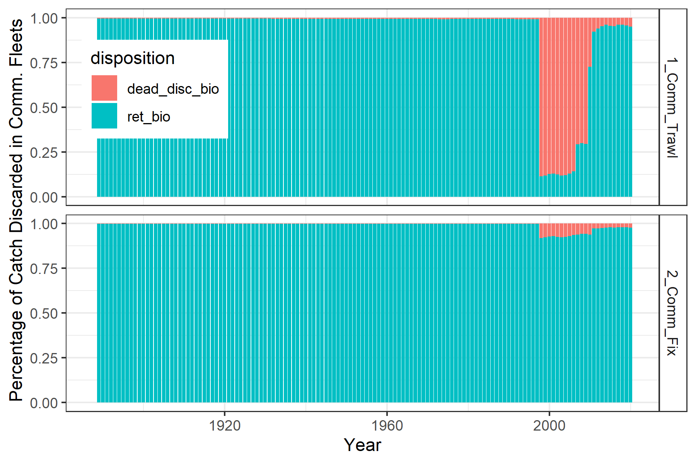]
.pull-left[South<br>]


---

# 04

.pull-left[North<br>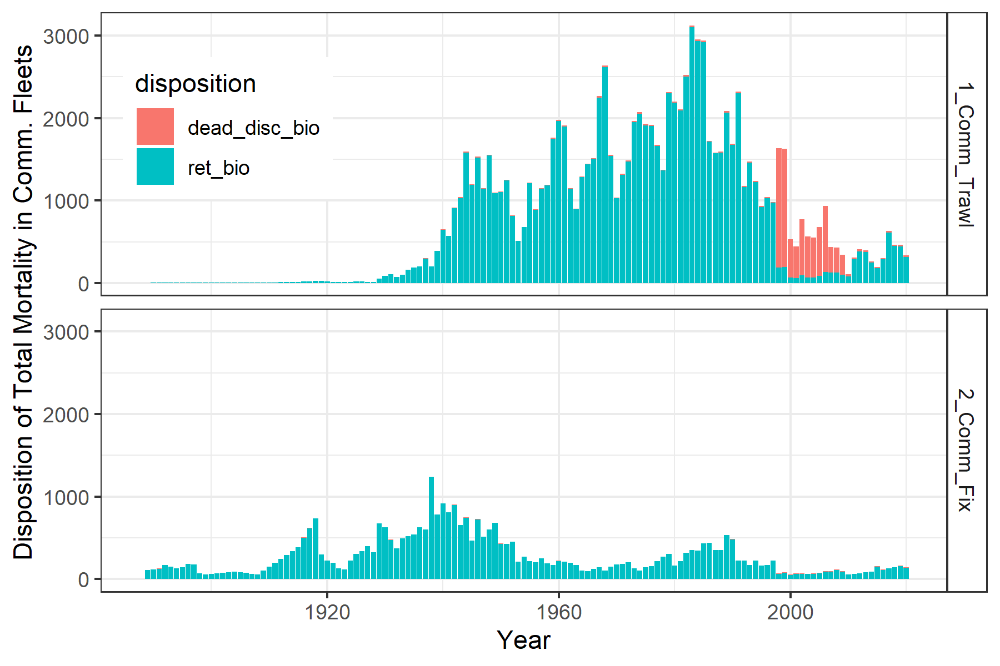]
.pull-left[South<br>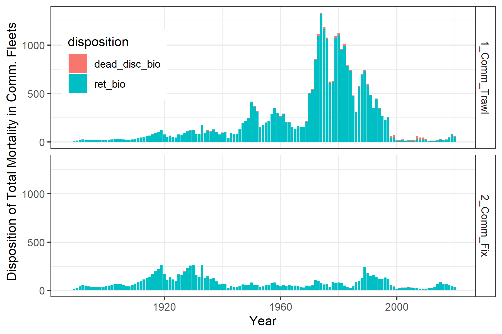]
