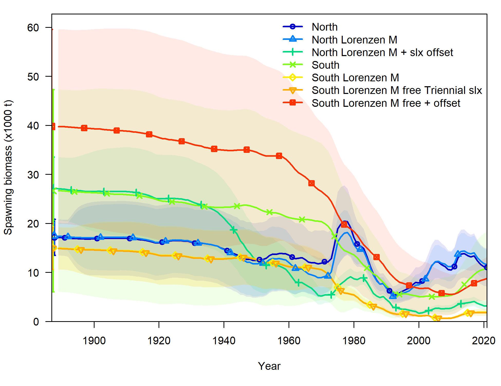
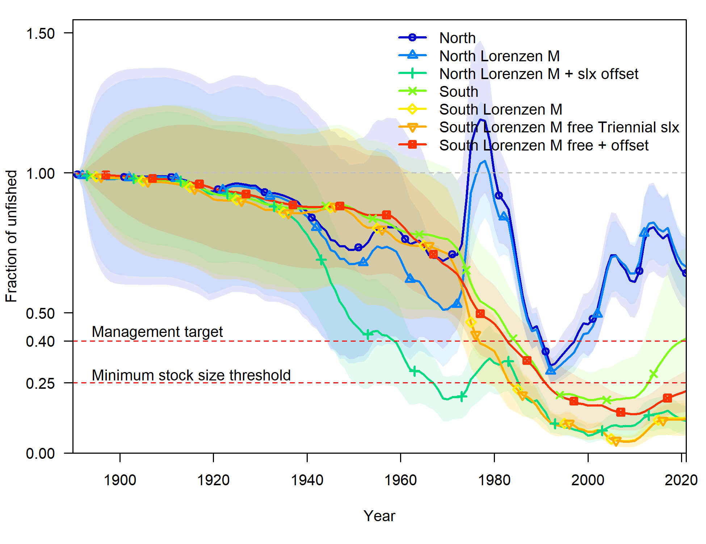
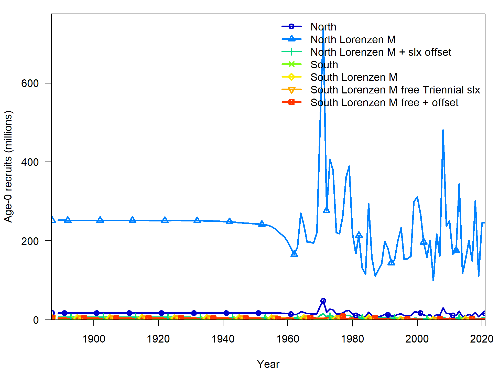
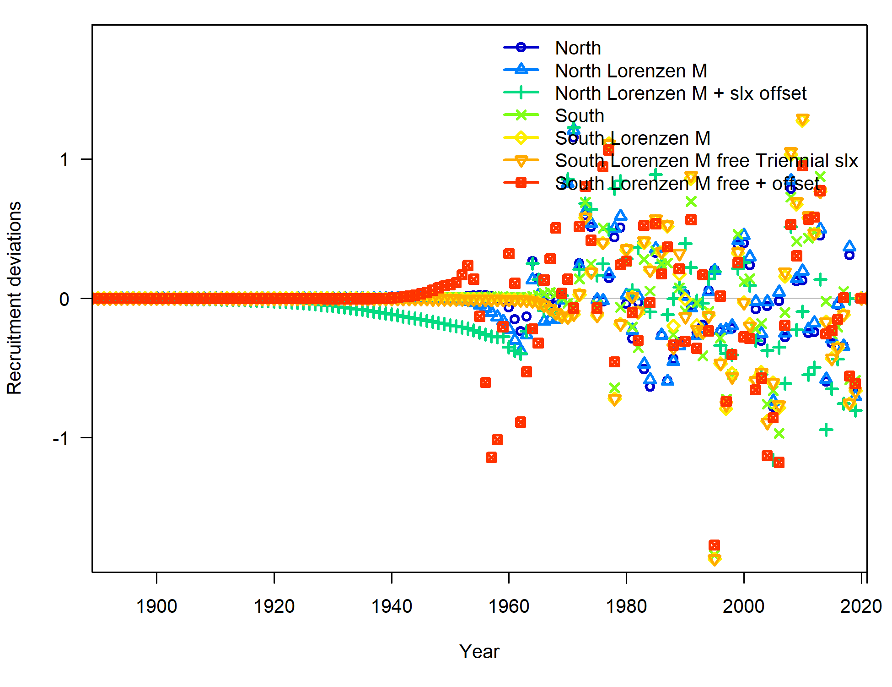
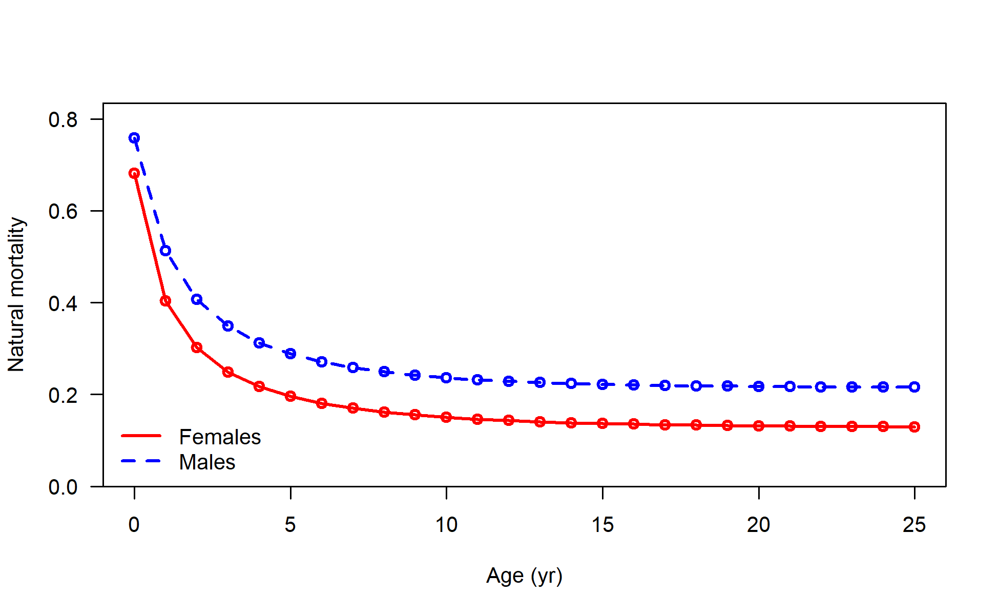
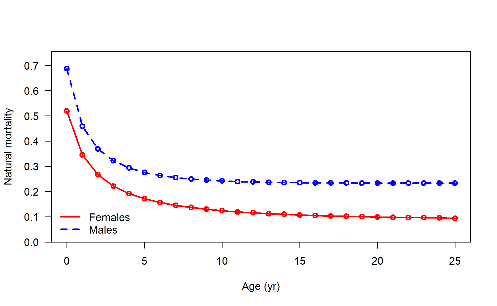
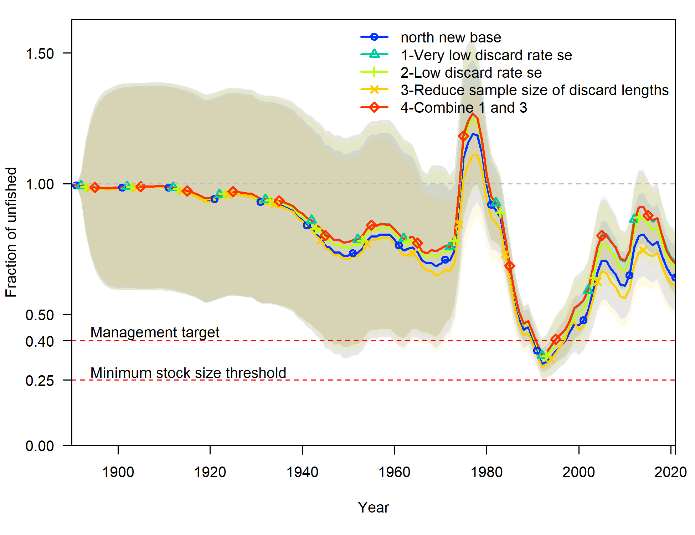

```{r setup, include=FALSE}
knitr::opts_chunk$set(
  echo = FALSE,
  message = FALSE,
  warning = FALSE,
  message = FALSE,
#   dev = "svg",
  fig.width = 12,
  fig.height = 12
  # fig.retina = 3
  )
xaringanthemer::style_mono_accent(
  # base_color = nmfspalette::nmfs_cols("darkblue"),
  base_color = "#00467F",
  header_font_google = xaringanthemer::google_font("Josefin Sans"),
  text_font_google   = xaringanthemer::google_font("Montserrat", "300", "300i"),
  code_font_google   = xaringanthemer::google_font("Fira Mono"),
  colors = c(noaablue = "#00467F")
)
```

class: title-slide, inverse
```{css}
<style>
.center2 {
  margin: 0;
  position: absolute;
  top: 50%;
  left: 50%;
  -ms-transform: translate(-50%, -50%);
  transform: translate(-50%, -50%);
}
</style>
```
```{css}
.code-bg-white .remark-code, .code-bg-white .remark-code * {
 background-color:white!important;
}
```

.bg-text[
# STAR requests 10-14

- Lorenzen _M_
- Selectivity offsets
- More selectivity offsets
- Likelihood profiles
- Discards

<hr />
Lingcod STAT<br><br>
July 14-15, 2021<br>
]

---

# 10 Request

### Perform runs for both North and South base models with the Lorenzen mortality function. The reference age for the natural mortality prior should be age eight (8). Provide the model comparisons slides and tables/figures with likelihoods and key parameter outputs, selectivity outputs, etc. for panel review.

---

### 10 Compare time series

.pull-left[

]

.pull-right[

]

---

### 10 Compare recruitment

.pull-left[

]

.pull-right[

]

---

### 10 Compare M

.pull-left[

]

.pull-right[

]

---

### 10 Compare likelihoods North

<p style="margin-top:-25px;">
`r table_sens("../figures/STAR_requests10/sens_table_n_star.csv", 
              caption = "", format = "html") %>%
      kableExtra::kable_styling(font_size = 12) 
`
---

### 10 Compare likelihoods South

<p style="margin-top:-25px;">
`r table_sens("../figures/STAR_requests10/sens_table_s_star.csv", 
              caption = "", format = "html") %>%
      kableExtra::kable_styling(font_size = 12) 
`
---

# Request 11

### Request: Perform runs for both the north and south base models in which sex-specific selectivity offsets are implemented for fisheries but not surveys. Explore other parameterizations of the selectivity offset as time might allow. Provide the model comparisons slides and tables/figures with likelihoods and key parameter outputs, selectivity outputs, etc. for panel review

---

### 11 Time series

.pull-left[

]

.pull-right[

]

---

### 11 Selectivity
.pull-left[
<p style="margin-top:-25px;">
North selectivity


]

.pull-right[
<p style="margin-top:-25px;">
South selectivity


]

---

### 11 Likelihoods north

.pull-left[
<p style="margin-top:-25px;">
`r table_sens("../tables/sens_table_n_star11.csv", 
              caption = "", format = "html") %>%
      kableExtra::kable_styling(font_size = 12) 
`
]

.pull-right[
<p style="margin-top:-25px;">
`r table_sens("../tables/sens_table_s_star11.csv", 
              caption = "", format = "html") %>%
      kableExtra::kable_styling(font_size = 12) 
`
]

---

# Request 12

### Explore freeing up the peak and the descending limbs of the offset selectivity curves for lingcod in both the northern and southern models, including the base model and the model from request 11. Try this parameter by parameter, or in a combination deemed reasonable by the STAT. Provide model comparison slides.

---

### 12

Process: start by simplifying the selectivity parameterization and and then add back additional
parameters, including sex-specific offsets in order to find a good balance between 
adequate fits to the data, reasonable selectivity shapes, and reasonable overall results.

The north base model has several fixed parameters controlling dome-shaped selectivity,
all these were freed up before the explorations to allow things to become domed as needed.

No re-tuning was done.

---

---

# STAR Request 12
<small>

sens_number | description
--- | ---
413_asymptotic_TW | fix the commercial trawl selectivity to be asymptotic for all blocks 
414_descend_shared_across_blocks | make the descending slope of the selectivity function equal for all blocks 
415_sex_sel_descend_shared | make the descending slope of the selectivity function sex-specific and equal for all blocks 
416_descend_shared_rec | make the descending slope of the selectivity function equal for all blocks within the rec fleets 
417_sex_sel_descend_shared_rec | make the descending slope of the selectivity function sex-specific and equal for all blocks within the rec fleets  
419_sex_sel_descend | make the descending slope of the selectivity function sex-specific
420_sex_sel_scale_descend_fisheries | make the scale and descending slope of the selectivity function sex-specific for fisheries only
421_sex_sel_peak_descend_fisheries | make the peak and descending slope of the selectivity function sex-specific for fisheries only

</small>
---

### STAR Request 12

.pull-left-30[
]

.pull-right-70[

]

---

### STAR Request 12

<p style="margin-top:-30px;">
`r table_sens("../tables/sens_table_n_star12.csv", 
              caption = "", format = "html") %>%
      kableExtra::kable_styling(font_size = 12) 
`

---

### STAR Request 12

Now dynamically show additional figures of selectivity estimates not included in presentation.

---

# Request 13

### Provide a likelihood profile for female M for the model that the STAT deems most plausible based on the result from request 12. M values should range from 0.1 to 0.5.

---

### 13

No clear smoking gun to profile over!

The run we did profile over is having a hard time converging with low estimates of _M_.

We could show these results but we are not sure how helpful it is towards getting a base model.

---

# Request 14

### Investigate the discrepancies in catches between the GEMM reports and the northern model estimates. Explore modeling methods to attempt to improve the fit to the dead discard rates in the model to produce dead discard estimates that are more in line with the GEMM values. This adjustment would consider these earlier years (1998- 2001) as well. This investigation should focus on the trawl fleet.
---

### 14 Compare time series

.pull-left[

]

.pull-right[

]

---

### 14 Compare discard fits

.pull-left[

]
.pull-right[

]

---

### 14 Likelihood values

<p style="margin-top:-25px;">
`r table_sens("../figures/STAR_request14/sens_table_n_star14.csv", 
              caption = "", format = "html") %>%
      kableExtra::kable_styling(font_size = 12) 
`
</p>

---

### 14 Discards

```{r, results = "asis"}
knitr::kable(read.csv("../figures/STAR_request14/discard_table_n_star14.csv"), format = "html") %>%
      kableExtra::kable_styling(font_size = 12) 
```
